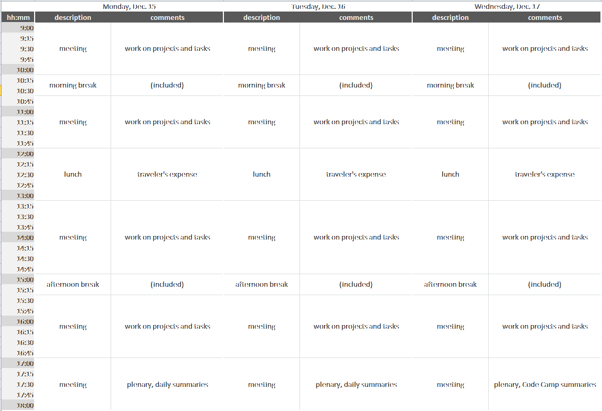

The code camp allows existing NeXus developers to meet and work together
on developing software or resolving particular NeXus design issues.

See [NIAC2014](NIAC2014 "wikilink") for administrative details about
this meeting.

Planned Schedule (subject to change)
------------------------------------

Topics to be Considered
-----------------------

A subset will be chosen on the first day of the meeting.

Walk through

-   [Issues](https://github.com/nexusformat/definitions/issues) posted
    on the [NeXus GitHub](https://github.com/nexusformat) repository
-   Proposals and other topics listed on the
    [Discussions](Discussions "wikilink") page
-   Close issues that are of minor importance and not of particular
    concern to anybody and not likely to be resolved any soon.

Choose topics from the preliminary list below:

-   Procedural questions:
    -   How to organize proposals and discussions
    -   How to remove ballast, when to break compatibility, versioning
        and validation
-   Fundamental design issues:
    -   Clarify rank specification
        -   related to
            [\#266](https://github.com/nexusformat/definitions/issues/266):
            implement difference in rules between base classes and
            application definitions
    -   Discuss [NeXus interfaces](Objects_or_Interfaces "wikilink")
    -   [How to avoid name clashes during future extensions of the Nexus
        standard](How_to_avoid_name_clashes_during_future_extensions_of_the_Nexus_standard "wikilink")
    -   Optional contents in application definitions?
    -   Discuss lightweight tags versus application definitions
    -   Rules for multi file NeXus files
-   Class specifications:
    -   NXformula?
    -   NXdata: Assigning axes to data once more again
    -   Prepare contributed definitions for ratification
-   Work on software:
    -   validation tools (nxvalidate or NXvalidate): state (cf
        [\#169](https://github.com/nexusformat/definitions/issues/169),
        [\#251](https://github.com/nexusformat/definitions/issues/251),
        [\#300](https://github.com/nexusformat/definitions/issues/300)),
        further development, WWW service, use of NeXpy/Python-API for
        validation
    -   New NAPI release?
    -   [\#230](https://github.com/nexusformat/definitions/issues/230):
        use cmake to build Sphinx documentation
-   Finish support for attribute arrays (who proposed this? please
    provide details!)
-   Off-site excursion to -tba-

Agenda
------

To be decided on the first day of the 2014 Code Camp.

### Wednesday

-   public talk: *Current State of HDF5*, Elena Pourmal, The HDF Group,
    location: 401/A1100

