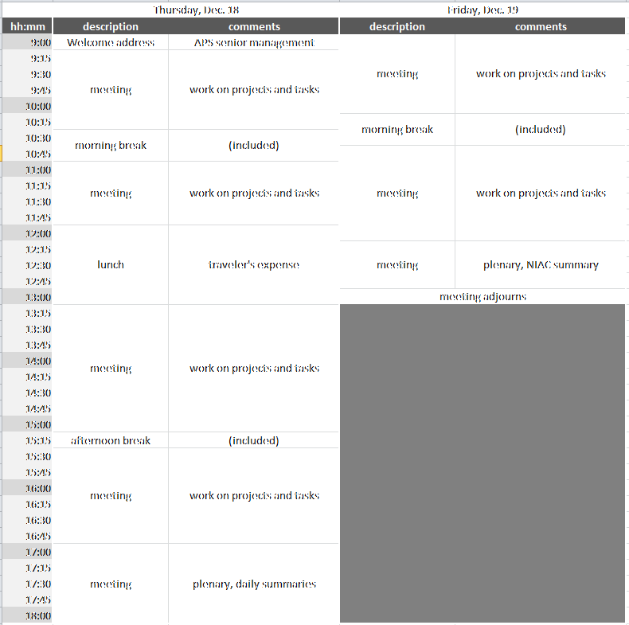

NIAC Meeting
------------

This is a meeting for members of the NeXus International Advisory
committee and other interested persons. It generally discusses matters
of policy and strategy, but can discuss specific NeXus instrument
definitions if the relevant experts are in attendance.

See [NIAC2014](NIAC2014 "wikilink") for administrative details about
this meeting.

### Schedule

The NIAC2014 Meeting takes place in building 437, conference room C010,
starting at 9am. Evening meal is planned for 7 pm each day.

Notes:

1.  amenities at morning and afternoon breaks will be provided
2.  breakfast, lunch, dinner will be in a local restaurant at traveler's
    expense

### Agenda

-   Votes on new members
-   Electing new officers, candidates get ready!
-   Revise Constitution [ Terms of Reference
    ](NIAC#Terms_of_Reference "wikilink"):
    -   item 3: change wording of “instrument and group class
        definitions” to contemporary terms (base classes and instrument
        definitions)
-   Examination of contributed definitions and consideration for
    ratification:
    -   joint CIF/NeXus NXmx
    -   NXarpes
    -   NXcanSAS
    -   NXcite
    -   NXgrating
    -   NXstxm
    -   NXtransformations
    -   NXzone\_plate
    -   others ...
-   Deprecation of NeXus polar coordinate system, NXgeometry?
-   Do we want better standardization and documentation of NeXus
    processes?
-   Discussion about how we assign priorities and respond to the
    community
-   Do we want NeXus Interfaces for improving base class documentation?
-   application definitions: can some items be optional?
-   Data Features (lightweight tags with recipes) versus application
    definitions?
-   Rules for multi file NeXus files
-   NXdata:
    -   proposal: describe [ how to find the default
        data](2014_How_to_find_default_data "wikilink")
    -   proposal: describe how data are related (particularly: [ axes
        and uncertainties](2014_axes_and_uncertainties "wikilink"))
-   NXformula
-   [Update for NXflou application
    definition](Update_for_NXflou_application_definition "wikilink")

### Notes

#### Thursday

#### Friday

### Minutes
