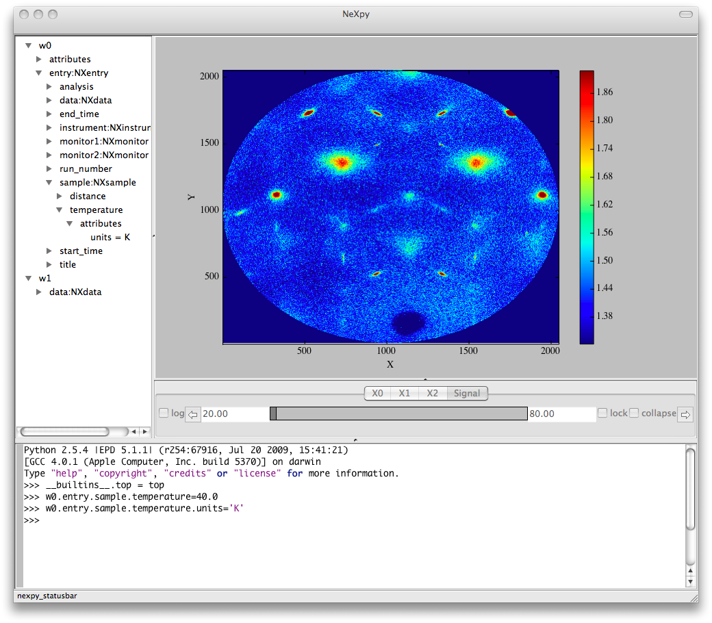

NeXpy provides a high-level Python interface to NeXus data contained
within a simple GUI. It is designed to provide an intuitive interactive
toolbox allowing users both to access existing NeXus files and to create
new NeXus-conforming data structures without expert knowledge of the
file format.

Installation
------------

NeXpy is in the early stages of development, and so there has been no
stable release yet. However, it is available for testing purposes only.
To check out the latest version from the
[Mercurial](http://mercurial.selenic.com/) repository and install the
NeXpy package to the standard Python site-packages directory,:

`> hg clone `[`http://mercurial.mcs.anl.gov/repos/nexpy`](http://mercurial.mcs.anl.gov/repos/nexpy)  
`> cd nexpy`  
`> python setup.py install`  
`> nexpy`  

This assumes that the standard Python script directory is in your
default path.

The source code can also be viewed on the [NeXpy Trac
Server](http://trac.mcs.anl.gov/projects/nexpy/).

GUI Shell
---------

 There are a
number of useful features available when running NeXpy within the GUI
shell.

1.  Data can be loaded with the <File:Open> menu item using a standard
    file browser window.
2.  All current NeXus data trees are easy to inspect in the pane on the
    upper left side. Hovering over a data item produces a tooltip
    containing a list of all the item's children. The root level of all
    newly created groups are automatically displayed in the tree.
3.  NXdata and NXmonitor plots can be displayed by right-clicking and
    choosing 'Plot'.
4.  Axis limits are set by a series of slider bars.
5.  The scripting shell provides convenient autocompletion, and
    automatically displays function docstrings as a tooltip when you
    open the function parentheses.

