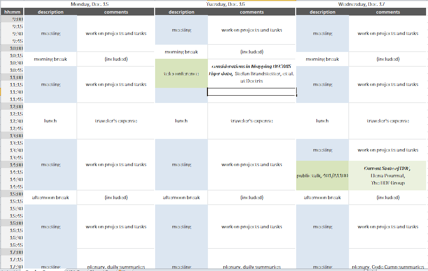

=================
NIAC2014 CodeCamp
=================

.. container:: content

   .. container:: page

      .. rubric:: NIAC2014 CodeCamp
         :name: NIAC2014_CodeCamp_niac2014-codecamp
         :class: page-title

      The code camp allows existing NeXus developers to meet and work
      together on developing software or resolving particular NeXus
      design issues.

      See `NIAC2014 <../niac/NIAC2014.html>`__ for administrative details about
      this meeting.

      .. rubric:: Planned Schedule (subject to change)
         :name: planned-schedule-subject-to-change

      |2014-CodeCamp-Schedule-MTW.png|

      .. rubric:: Topics to be Considered
         :name: NIAC2014_CodeCamp_topics-to-be-considered

      A subset will be chosen on the first day of the meeting.

      Walk through

      -  `Issues <https://github.com/nexusformat/definitions/issues>`__
         posted on the `NeXus GitHub <https://github.com/nexusformat>`__
         repository
      -  Proposals and other topics listed on the
         Discussions <Discussions.html> page
      -  Close issues that are of minor importance and not of particular
         concern to anybody and not likely to be resolved any soon.

      Choose topics from the preliminary list below:

      -  Procedural questions:

         -  How to organize proposals and discussions
         -  How to remove ballast, when to break compatibility,
            versioning and validation

      -  Fundamental design issues:

         -  Clarify rank specification

            -  related to
               `#266 <https://github.com/nexusformat/definitions/issues/266>`__:
               implement difference in rules between base classes and
               application definitions

         -  Discuss `NeXus interfaces <../general_content/Objects_or_Interfaces.html>`__
         -  `How to avoid name clashes during future extensions of the
            Nexus
            standard <../general_content/How_to_avoid_name_clashes_during_future_extensions_of_the_Nexus_standard.html>`__
         -  Optional contents in application definitions?
         -  Discuss lightweight tags versus application definitions
         -  Rules for multi file NeXus files

      -  Class specifications:

         -  NXformula?
         -  NXdata: Assigning axes to data once more again
         -  Prepare contributed definitions for ratification

      -  Work on software:

         -  validation tools (nxvalidate or NXvalidate): state (cf
            `#169/defs <https://github.com/nexusformat/definitions/issues/169>`__,
            `#251/defs <https://github.com/nexusformat/definitions/issues/251>`__,
            `#300/defs <https://github.com/nexusformat/definitions/issues/300>`__,
            `#363/code <https://github.com/nexusformat/code/issues/363>`__),
            further development, WWW service, use of NeXpy/Python-API
            for validation
         -  New NAPI release?
         -  `#230 <https://github.com/nexusformat/definitions/issues/230>`__:
            use cmake to build Sphinx documentation

      -  Finish support for attribute arrays (who proposed this? please
         provide details!)
      -  Off-site excursion to -tba-

      .. rubric:: Agenda
         :name: NIAC2014_CodeCamp_agenda

      +-----------------+-----------------+-----------------+-----------------+
      |                 | \*Monday\*      | \*Tuesday\*     | -  Wednesday\*  |
      +=================+=================+=================+=================+
      | 9:00-10:00      | Review          | Short           | NAPI issues     |
      |                 |                 | procedural      |                 |
      +-----------------+-----------------+-----------------+-----------------+
      | 10:00-10:30     | Coffee          | Coffee          | Coffee          |
      +-----------------+-----------------+-----------------+-----------------+
      | 10:30-12:00     | | Cansas        | Telco with      |                 |
      |                 | | Axes          | DECTRIS         |                 |
      |                 | | Error         |                 |                 |
      +-----------------+-----------------+-----------------+-----------------+
      | 12:00-13:00     | Lunch           | Lunch           | Lunch           |
      +-----------------+-----------------+-----------------+-----------------+
      | 13:00-15:00     | | DECTRIS,      | nexpy           | HDF-5 talk      |
      |                 | | NXmx etc      |                 |                 |
      +-----------------+-----------------+-----------------+-----------------+
      | 15-15:30        | Coffee          | Coffee          | Coffee          |
      +-----------------+-----------------+-----------------+-----------------+
      | 15:30-18:00     | | MXmx,         | | Reprioritise  |                 |
      |                 | | when time     |   for last day  |                 |
      |                 |   smaller       | | Lightweight   |                 |
      |                 |   issues        |   tags and      |                 |
      |                 |                 |   interfaces    |                 |
      +-----------------+-----------------+-----------------+-----------------+

      .. rubric:: Tuesday
         :name: NIAC2014_CodeCamp_tuesday

      -  teleconference with Dectris: 10:30 AM

      .. rubric:: for end of day review
         :name: for-end-of-day-review

      -  `axes <http://wiki.nexusformat.org/2014_axes_and_uncertainties#Proposal_to_describe_multi-dimensional_data_.28Axes.29>`__
      -  `uncertainties <http://wiki.nexusformat.org/2014_axes_and_uncertainties#Uncertainties>`__

      .. rubric:: Wednesday
         :name: NIAC2014_CodeCamp_wednesday

      -  public talk: *Current State of HDF5*, Elena Pourmal, The HDF
         Group, location: 401/A1100

