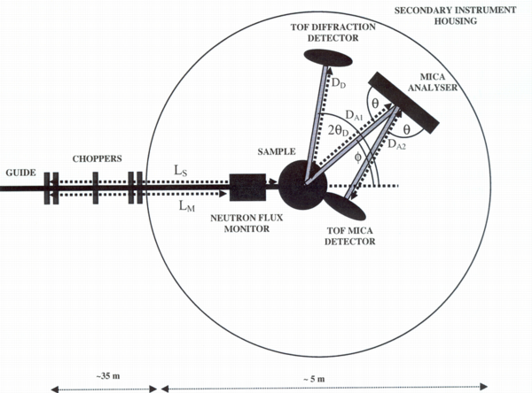

Indirect Time-of-Flight and Coordinates
=======================================

I am having some problems describing a indirect time-of-flight
instrument we are currently building. The name of the instrument is
MARS. See this image for a schema.

The instrument has 12 elastic detectors. These go in a separate NXentry
group and are covered by the the TOFNPD DTD. However, I missed
information about choppers in that DTD. This leads to my first question:
Is TOF-monitors, data and distances really the only items needed for
data analysis for TOFNPD?

There are also 12 inelastic detectors. Theya are supposed to go in
another NXentry group following the to-be-defined TOFNIG-DTD. Each of
them is mounted on a triffid together with an analyzer. The triffids are
positioned at various polar\_angles with respect to the sample. On each
triffid the analyzers move upwards and scatter neutrons into the
detectors below them. In order to make this perfectly clear: scattering
happens in the vertical plane. There are several problem here:

I tend to treat both the analyzers and the detectors as a bank each.
They are usually moved together; any differences can be caught in
parameter arrays.

How to describe the analyzer position? The polar\_angle is clear. I like
to think of the polar\_angle corresponding to longitude in a polar
coordinate system with the incoming beam describing the null meridian.
But the tile angle or latitude is missing from our simple coordinate
system. What we have is the azimuthal angle. From the use at the triple
axis I deduce that this is really a rotation around a vector connecting
the sample and the analyzer. This simply does not cut it. I suggest to
add a tilt angle out of the instrument plane, corresponding to latitude
to our simple coordinate system which would then consist of:
polar\_angle, tilt, distance and azimuthal\_angle.

How to describe the scattering between the analyzer and the detector?
Rather then defining yet another coordinate system, I would like to wrap
two theta between analyzer and detector into the tilt angle.

------------------------------------------------------------------------

May be I am just confused about [Coordinate
Systems] (Coordinate_Systems.html "wikilink") here. ----

------------------------------------------------------------------------

Conclusion
----------

01/2015 This page is totally obsolete. I think the problem was resolved
by changing the scattering plane. Now, the adequate solution is the
CIF-style description of the axes used.
