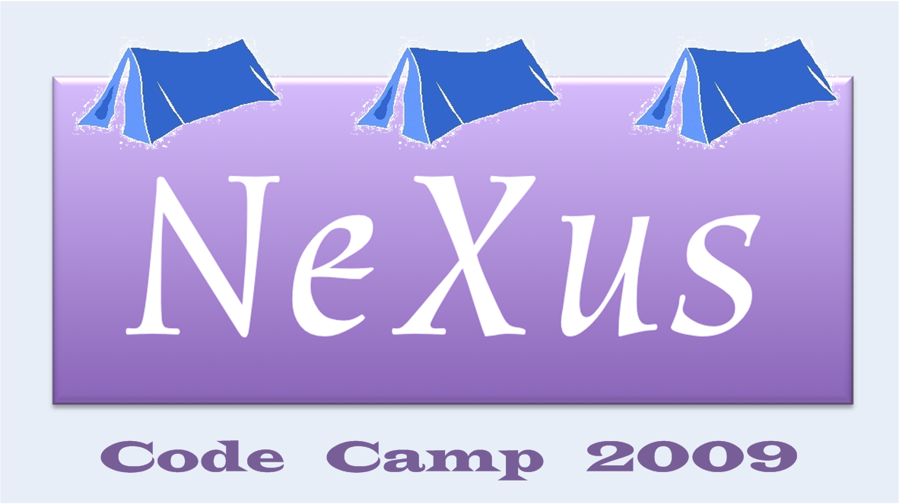

2009 NeXus Code Camp
====================

Purpose
-------

Develop NeXus software components through intense effort by small groups
working on specific projects and tasks. It is expected that those
attending the 2009 NeXus Code Camp will already have strong foundation
and understanding in aspects of the NeXus software and come ready with
knowledge, tools, and ideas to make significant progress during the
event. The specific projects and tasks, as well as the list of
participants, are described on this wiki and will be revised as the
event draws near.

(For more info on code camps, try searching Google for “code camp” or
“codeathon”. Events such as the [EPICS
Codeathon](http://www.aps.anl.gov/epics/meetings/codeathon.php) would be
reasonable templates for this first NeXus code camp.)

Dates
-----

-   October 16-18, 2009 (Friday - Sunday)

Agenda
------

### Business Matters

Since this is not to be a meeting of the full NIAC, no business matters
can be resolved.

### Projects and Tasks

These items are sorted in order of priority that they be finished. Only
items that currently exist in the project plan are being worked on.

1.  NXDL - NeXus Definition Language
2.  NXplot - a generalized NeXus file plotting tool
3.  NXvalidate - a NeXus file validator
4.  NXfiletool - an anything to NeXus and NeXus to anything converter.
    Look at recently added NXextract tool and combining with NXtranslate
5.  NXaperture - right design? too complicated? alternatives:
    NXsquareaperture, NXroundaperture, ...
6.  NeXus manual
7.  review NeXus “definitions” tickets in TRAC
8.  NXbrowse

### Schedule

-   arrive Thursday evening
-   conference check-in Friday morning
-   meet all day Friday
-   meet all day Saturday
-   meet all day Sunday
-   checkout Monday morning

Here is the daily schedule:

| time                | description     | comments                    |
|---------------------|-----------------|-----------------------------|
| 9:00 - 10:15 AM     | meeting         | work on projects and tasks  |
| 10:15 - 10:45 AM    | morning break   | (included)                  |
| 10:45 AM - 12:00 PM | meeting         | work on projects and tasks  |
| 12:00 - 1:15 PM     | lunch           | offsite, traveler's expense |
| 1:15 - 3:15 PM      | meeting         | work on projects and tasks  |
| 3:15 - 3:30 PM      | afternoon break | (included)                  |
| 3:30 - 5:00 PM      | meeting         | work on projects and tasks  |
| 5:00 - 6:00 PM      | meeting         | daily summary (plenary)     |

Notes:

1.  late-afternoon wrap-up (plenary) each day
2.  morning and afternoon breaks will be included in amenities charge
3.  breakfast, lunch, dinner will be in a local restaurant at traveler's
    expense

Practical Matters
-----------------

### Venue

Best Western University Plaza, Evanston, IL  
1501 Sherman Avenue, Evanston, Illinois, 60201-4416  
Toll Free Reservations: 800-381-2830  
Fax: 847-328-3090  
<http://www.bwuniversityplaza.com/>

Please reserve your own rooms directly with the hotel (website, phone,
...)

### Directions and Maps

-   map to hotel:
    <http://www.google.com/search?q=Best+Western+University+Plaza%2C+Evanston%2C+IL>
-   airport:
    -   Chicago O'Hare (ORD): international
    -   Chicago Midway (MDW): domestic
    -   Milwaukee, WI Mitchell Field (MKE): distant alternative
-   intercity train:
    -   Chicago Union Station served by Amtrak
-   taxi:
    -   Call for a taxi pickup only after you have all your bags
    -   Must be a taxi that goes to Chicago suburbs
    -   suburban taxi will pickup in second lane of arrivals at Chicago
        O'Hare airport
    -   <http://www.americantaxi.com>, 1-800-244-1177 (automated system)
    -   <http://www.norshorecab.com>, 1-847-673-8294
    -   <http://www.303taxi.com>, 1-847-303-0303
-   airport bus: <http://www.airportexpress.com/shuttles/ohare.html>
-   commuter train:
    -   2 Chicago Elevated “L” train stations within four blocks
    -   Chicago Metra station within four blocks

### Host

-   Pete Jemian
    -   Advanced Photon Source, Argonne National Laboratory
    -   email: jemian \_at\* anl.gov
    -   office phone: 1-630-252-3189 (forwards to mobile)
    -   Google voice: +1-847-859-9775 (forwards to mobile)

### Costs

-   Expect hotel rate to be US$119/night (approximate, subject to
    change)
    -   Please reserve your own rooms directly with the hotel (website,
        phone, ...)
-   Conference fee: US$150/person
    -   conference room
    -   food at morning and afternoon breaks
    -   perhaps a small meeting souvenir
-   regular meals (breakfast, lunch, dinner) will be traveler's expense

### Equipment

| item                                             | quantity   | who provides? |
|--------------------------------------------------|------------|---------------|
| projector & screen                               | 1 each     | host          |
| USB keyboards & mice                             | ?          | ?             |
| LCD displays (19" or so)                         | ?          | ?             |
| 120 VAC, 60 Hz, US-style 3-prong extension cords | sufficient | host          |
| foreign electrical power adapter                 | as needed  | traveler      |
| Wi-Fi connections                                | sufficient | hotel         |

### Participants

| participant                                              | affiliation                       | arriving          | departing | fees paid? |
|----------------------------------------------------------|-----------------------------------|-------------------|-----------|------------|
| [Pete Jemian] (Pete_Jemian.html "wikilink")             | [APS](http://www.aps.anl.gov)     | Thursday          | Monday    |            |
| [Freddie Akeroyd] (Freddie_Akeroyd.html "wikilink")     | [ISIS](https://www.isis.stfc.ac.uk/) | Thursday          | Monday    |            |
| [Stuart Campbell] (Stuart_Campbell.html "wikilink")     | [SNS](http://www.sns.gov)         | Thursday          | Monday    |            |
| [Nick Hauser] (nick.html "wikilink")                    | [ANSTO](http://www.ansto.gov.au/) | canceled          |
| [Nick Maliszewskyj] (Nick_Maliszewskyj.html "wikilink") | [NIST](http://www.nist.gov)       | telepresence only |
| [Mark Könnecke] (Mark_Koennecke.html "wikilink")        | [PSI](http://www.psi.ch)          | Thursday          | Monday    |            |
| [Peter Peterson] (Peter_Peterson.html "wikilink")       | [SNS](http://www.sns.gov)         | Thursday          | Monday    |            |
| [Tobias Richter] (Tobias_Richter.html "wikilink")       | [DLS](http://www.diamond.ac.uk)   | Thursday          | Monday    |            |

