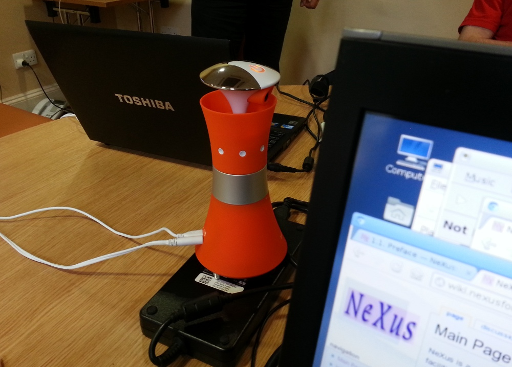

NIAC2012
========

Planning is currently underway for the NIAC / Code Camp meeting in 2012.
This is being organised to take place at [The Cosner's House, Abingdon,
UK](https://stfc.ukri.org/about-us/where-we-work/rutherford-appleton-laboratory/the-cosener-s-house/) and occur prior to the
[NOBUGS meeting](https://www.nobugsconference.org/).

Dates are:

-   NeXus code camp -&gt; 18th / 19th September 2012
-   NIAC Meeting -&gt; 20th / 21th September 2012

<!-- -->

-   [NoBugs meeting](https://www.nobugsconference.org/) -&gt;
    24th-26th September 2012

Location and Accomodation
-------------------------

[The Cosner's House, Abingdon,
UK](https://stfc.ukri.org/about-us/where-we-work/rutherford-appleton-laboratory/the-cosener-s-house/)

    Science and Technology Facilities Council
    The Cosener's House
    Abbey Close
    Abingdon
    Oxfordshire
    OX14 3JD
    United Kingdom

The fee of £200 per event covers two nights accommodation and all meals
during the days - see Logistics below

Registration is via the [NOBUGS conference
website](http://www.nobugs2012.org/NOBUGS/registration/NeXus.html)

Travel
------

If arriving at Heathrow, take the [Oxford “airline”
bus](http://www.oxfordbus.co.uk/main.php?page_id=24), but get off at the
penultimate stop [St
Aldates](http://www.oxfordbus.co.uk/content/img/cms/wtboxfordmap2100512.jpg)
rather than Oxford bus station. Public transport to Abingdon [leaves
from St
Aldates](http://www.oxfordbus.co.uk/content/doc/cms/CityCentre%20120212.pdf)
either [Oxford bus company buses 35 or
X3](http://www.oxfordbus.co.uk/main.php?page_id=21) or [Thames travel
bus X2](http://www.thames-travel.co.uk/timetables.htm) get off at the
Vineyard or Stratton Way and walk to [Coseners
house](https://stfc.ukri.org/about-us/where-we-work/rutherford-appleton-laboratory/the-cosener-s-house/)

If you are arriving later and wish to take a taxi/minicab from Oxford to
Coseners House, there is a taxi rank at the final Oxford “airline” stop
(Gloucester Green coach station). More information about taxi/minicab
servcies in Oxford are on [this
page](http://www.oxford.gov.uk/PageRender/decTS/Public_transport_occw.htm).

Logistics
---------

People arriving for the NIAC and staying on for NOBUGS conference the
following week at \[<https://stfc.ukri.org/about-us/>| RAL\]
can keep their rooms in Cosner's. Daily transport will be available to
and from the NOBUGS venue at the RAL site.

The meeting fee for NIAC/Nexus code camp is the Coseners house 24 hour
delegate rate, which covers Dinner, B+B, plus lunch. So:

-   the code camp fee will cover dinner on Monday and Tuesday evenings,
    2 nights accommodation, breakfast+lunch on Tuesday and Wednesday.
-   the NIAC fee will cover dinner on Wednesday and Thursday evenings, 2
    night accommodation, breakfast+lunch on Thursday and Friday.

**If you will be staying Friday evening (and onwards) you need to
[reserve and pay for this separately yourself with Coseners
house](http://www.nobugs2012.org/NOBUGS/accommodation.html)**

List of Attendees
-----------------

Please add your name to this table after registering for the meetings
via the [NOBUGS
site](http://www.nobugs2012.org/NOBUGS/registration/NeXus.html)

| Name                                                         | Company/Institute                                         | Code Camp (18/19) | NIAC (20/21) | NOBUGS (24-26) | Arrival date (accommodation needed from)      | Departure date |
|--------------------------------------------------------------|-----------------------------------------------------------|-------------------|--------------|----------------|-----------------------------------------------|----------------|
| [Freddie Akeroyd] (Freddie_Akeroyd.html "wikilink")         | | ISIS Facility, Rutherford Appleton Laboratory, UK       | | YES             | | YES        | | YES          | | Day attendee                                | | Day attendee |
| [Tobias Richter] (Tobias_Richter.html "wikilink")           | | Diamond Light Source, UK                                | | YES             | | YES        | | YES          | | Day attendee                                | | Day attendee |
| [Steve Cottrell] (Steve_Cottrell.html "wikilink")           | | ISIS Facility, Rutherford Appleton Laboratory, UK       | | NO              | | YES        | | YES          | | Day attendee                                | | Day attendee |
| [Ben Watts] (Ben_Watts.html "wikilink")                     | | Swiss Light Source, Paul Scherrer Institut, Switzerland | | YES             | | YES        | | NO           | | 18/09/2012                                  | | 22/09/2012   |
| [Jiro Suzuki] (Jiro_Suzuki.html "wikilink")                 | | J-PARC, KEK, Japan                                      | | NO              | | YES        | | YES          | | 19/09/2012                                  | |              |
| [Joachim Wuttke] (Joachim_Wuttke.html "wikilink")           | | JCNS at FRM II                                          | | NO              | | YES        | | YES          | | 19/09/2012                                  | |              |
| [Mark Koennecke] (Mark_Koennecke.html "wikilink")           | | Paul Scherrer Institute, Switzerland                    | | YES             | | YES        | | YES          | | 17/09/2012                                  | |              |
| [Jens-Uwe Hoffmann] (Jens-Uwe_Hoffmann.html "wikilink")     | | Helmholtz-Zentrum Berlin                                | | YES             | | YES        | | YES          | | 18/09/2012                                  | |              |
| [Eugen Wintersberger] (Eugen_Wintersberger.html "wikilink") | | DESY                                                    | | YES             | | YES        | | YES          | | 17/09/2012                                  | |              |
| [Herbert J Bernstein] (Herbert_J_Bernstein.html "wikilink") | | Dowling College, USA                                    | | NO              | | YES        | | YES (24th)   | | 19/09/2012                                  | | 21/09/2012   |
| [Fajin Yuan] (Fajin_Yuan.html "wikilink")                   | | Diamond Light Source                                    | | YES             | | YES        | | YES          | | Day attendee                                | | Day attendee |
| [Graeme Winter] (Graeme_Winter.html "wikilink")             | | Diamond Light Source                                    | | YES (19th)      | | YES (20th) | | NO           | | Day attendee                                | | Day attendee |
| [David Mannicke] (David_Mannicke.html "wikilink")           | | ANSTO                                                   | | YES             | | YES        | | YES          | | 17/09/2012                                  | | 27/09/2012   |
| [Peter Peterson] (Peter_Peterson.html "wikilink")           | | SNS, ORNL, USA                                          | | NO              | | YES        | | YES          | | 19/09/2012                                  | | 27/09/2012   |
| [Armando Sole] (Armando_Sole.html "wikilink")               | | ESRF                                                    | | NO              | | YES        | | NO           | | 19/09/2012                                  | | 22/09/2012   |
| [Pete Jemian] (Pete_Jemian.html "wikilink")                 | | APS                                                     | | Skype           | | Skype      | | NO           | | 2012-09-18 (Skype only, no lodgingrequired) | | 2012-09-21   |
||

Agenda
------

Both meetings are taking place in the Hamilton room at Coseners house,
starting at 9am. Evening meal is scheduled for 7pm each day

### NeXus Code Camp

The code camp allows existing NeXus developers to meet and work together
on developing software or resolving particular NeXus design issues. A
preliminary list of items is listed below, but the exact subset is
decided on the first day of the meeting.

-   Finish CIF coordinate issue
-   PyTree API Tests
-   Cleanup NeXus applications
-   NXdict replacement design
-   Automatisation and documentation of NeXus release process
    -   Implement Continuous Integration
    -   Write more unit tests
-   Change documentation from DocBook to Restructured Text
    (Sphinx)``http://download.nexusformat.org/sphinx/``
-   Cleanup trac-tickets
-   Discuss timed data
-   Develop a materials definition to present to NIAC
-   Do we switch to CMake for all builds?
-   How to integrate sphinx documentation building into Cmake

### NIAC Meeting

This is a meeting for members of the NeXus International Advisory
committee and other interested persons. It generally discusses matters
of policy and strategy, but can discuss specific NeXus instrument
definitions if the relevant experts are in attendance.

-   Report on the status of NeXus and Overview
-   Voting officers
-   Strategy discussion: Where do we go with NeXus?
-   Develop and ratify material definition for samples and sensors
-   Roadmap to OO-NeXus
-   Review of DECTRIS additions to NXdetector
-   Review of added synchrotron beamline base classes
-   Will the tech committee be allowed decide on fields and base
    classes?

### Meeting Minutes

Date: 20 Sept 2012

Attendees:

-   Mark Koennecke, SINQ
-   Fred Akeroyd, RAL
-   Tobias Richter, Diamond
-   Peter Peterson, SNS
-   David Mannicke, ANSTO
-   Armando Sole, ESRF
-   Herbert Bernstein, imgCIF
-   Jiro Suzuki, JPARC
-   Joachim Wuttke, FRM and JCNS
-   Ben Watts, SLS
-   Eugen Wintersberger, DESY
-   Jen-Uwe Hoffmann, HMI
-   Steve Cottrell, Diamond
-   Graeme Winter, Diamond
-   Pete Jemian, APS (via Skype)

<!-- -->

-   introductions
-   Recap NeXus and recent developments
    -   Previous meeting
        -   NXsubentry and NXcollection classes
        -   Support for CIF style coordinates
        -   Non C-storage order arrays: offset, stride atributes
        -   Python Tree API part of API

<!-- -->

-   HDRI: High Data Rate Initiative making something NeXus-like
    -   Asked to revise synchrotron base classes
    -   Eugen: software to write files is nearly ready and
        implementation will be installed at as many beamlines as
        possible in the Dec shutdown
-   PANDATA
    -   NeXus at first well received
    -   made plans for method-specific formats
    -   Dormant
-   2011 Code Camp in APS
    -   NX\_unlimited for all dimensions
    -   64 bit dimensions
    -   update to HDF5-1.8
    -   Doc updates. now reasonable up to date and understandable.
    -   WWW-site from manual
    -   tests for python API 30% complete
    -   Python Tree API cleaned up
    -   Parallel HDF deemed not useful for NeXus because performance
        limited systems don't want any extras
-   DECTRIS collaboration (Pilatus and Eiger manufacturer)
    -   NeXus/HDF5 for Eiger
    -   Add extra fields for detector parameters
    -   write sets of ~10,000 images into separate files (workaround for
        data rate issues and HDF5 doesn't allow sections of same data
        group in different files)
    -   write with compression (5-10GB/s data rates!!!)

<!-- -->

-   How much can we compromise with DECTRIS
    -   Tool to convert data to standard HDF5 (they are using
        non-standard compression)
-   HDF5 workshop at PSI
    -   DECTRIS (DESY) pays for writing pre-compressed chunks and
        compression plugins
-   HDF5 new features
    -   Asynchronous IO
    -   Journaling
    -   Single writer, multiple reader semantics
    -   better fault tolerance
    -   in-memory HDF5 files (very fast writing)
    -   shared object headers
-   HDF5 intended features
    -   better multi-threading
    -   virtual object layer, completely replaces storage layer
        -   can use HDF5 data model without the file formats
        -   allows more storage models
        -   metadata server for better parallel support
        -   mirroring, stacking
    -   better parallel support
-   NAPI release 4.3, Application defs 3.1
    -   features from 2011 code camp
    -   preparing packages in linux repos
-   code camp 2012
    -   move docs to sphinx
        -   more wiki-like syntax - easier!
        -   URL: ?? (bug in build process, so not quite ready yet)
    -   cleaned up trac tickets
    -   drop autoconf for CMake
    -   Resolved CIF coordinate issue
    -   good suggestion for handling axes of multidimensional data sets
    -   cleanup of applications: nx2dtd, NXdump, ... dropped
-   Topics for NIAC 2012
    -   Quo vadis
    -   roadmap OO
    -   CIF coordinates
    -   process for changing base classes
    -   review synchrotron classes
    -   review addition to NXdetector
    -   Materials defs
    -   Multi-D array axes encoding
    -   what to do about expired NIAC members?
    -   Elect new officers
-   Questions from code camp
    -   anyone using NXcharacterisation?
    -   who is using F77 API?
    -   do we get into timed data?

<!-- -->

-   discuss priorities (reordered below in descending priority)
    -   Elect new officers (defer by 1 day to allow newcomers to get to
        know others)
    -   Quo vadis
    -   CIF coordinates
    -   roadmap OO
    -   Multi-D array axes encoding
    -   Materials defs
    -   what to do about expired NIAC members?
    -   questions from code camp
        -   anyone using NXcharacterisation?
        -   who is using F77 API?
        -   do we get into timed data?
    -   DECTRIS meeting
    -   process for changing base classes
    -   review synchrotron classes
    -   review addition to NXdetector

<!-- -->

-   CIF revisit (MK presents CIF and options for adaptation to NeXus)
    -   Options:
        -   NXdependency group
        -   depends\_on attribute (tech committe prefered and
            recommended by HB)
            -   make vector mandatory and add offset\_unit
            -   HB will push CIF to make gravity declaration mandatory
                to ensure mapping between CIF and NeXus coords is
                possible

`Motion to accept CIF-style angle descriptions with discussed additions.`  
`Vote: for 9 against 0, abstain 4`

*Coffee break*

-   Quo Vadis
    -   Intro by Mark
        -   existence since 1996 and uptake is slow
        -   Do we persist in the same manner or change our ways?
        -   Others often reinvent NeXus
        -   New instruments often implement NeXus
        -   results of survey are surprisingly positive with more NeXus
            implementations than expected
        -   New developments:
            -   Dictionary Based Programming Techniques - Common Data
                Model (CDM)
            -   Tree Based Programming
            -   Requirements for data formats changing
                -   disks are cheap
                -   full logging becomes possible
                -   data rates are very high in some cases
    -   Discussion

AS: ESRF advocate dictionary/HDF5 and just use the few parts of NeXus
they want and ignore the rest (very pragmatic view).

TR: Need to take larger view and not get tied up in technical details.
need to engage with facilities using NeXus (eg ALBA).

BW: Need to emphasise community involvement - dictating standards is
historical problem of creating an example to start with.

JW: What is NeXus, is it something interchangeable? Have we been
truthful about what it can achieve? I have no problem in maintaining
tools to convert data to whatever format the users ask for.

JH: Users want physical meaning for the data recorded, not just numbers
whose meaning is obscured by instrument details. But to understand the
instrument, also need more raw values.

MK: Different use cases; 1. understanding instrument (raw values), 2.
exchange/data analysis (physical)

GW: Standard has value if I can read and understand a file without any
further information. As soon as you move away from that, it becomes a
huge problem to support the variants.

HB: Seen 2 issues; dictionary of names and format. People can use any
format and you have no control anyway. The only thing you need is that
every uses a common vocabulary. vocabularies tend to merge. separate
vocab and application definitions.

FA: if we concentrate app defs and vocab, then we are working towards
standards, tools are not required (there are plenty available). People
are choosing HDF5, help them come together and talk.

GW: data rates are a problem - HDF5 are needed. Don't want to have
facility-specific dialects of NeXus. Need consistence and completeness
(single file).

AS: performance issues get in the way of a single file, multiple files
must be acceptable.

GW: don't water it down - all or nothing!

EW: I tried to invent better than NeXus but failed. Users just want
basic data, but beamline scientist want to record everything in order to
know what the instrument is actually doing. Sometimes will need to
correct for strange instrument behavior that requires info not normally
needed by users. Making this general enough to use at more than one
beamline quickly leads to something NeXus-like.

HB: Offer - if you can agree on your vocab, I'll give you an IUCr
working group for adopting/working on your dictionary. I.e. CIF and
NeXus join forces!

JW: I support this. Clarity would help me. vocab is valuable to me, but
formats are minor technical details.

EW: Important thing is to make entry to Nexus easy. Some instruments are
unique and we don't have to worry about them. OO can help us define
terms.

HB: we use “prefixes” for namespaces, but are considering using general
XML. want to make sure terms don't conflict.

PJ: have image that NeXus legislates, but we should put out message that
we want to collaborate to reduce conflicts.

MK: make an action that we concentrate on dictionaries and appl defs.

GW: ImageCIF has good library that does a lot of work for me. It would
be easier to persuade people to use Nexus if we had the same kind of
library - part of analysis work is done by the library.

HB: maintaining libraries will get done if there is adoption.

GW: If we can get Nexus routines included in CBFlib, then my work
becomes much easier. analysis program writers will not resist.

Everyone agrees that moving CIF and NeXus closer would be great.

HB: CIF will make addition docs for IUCr people and will put a link to
NeXus doc from the IUCr website.

MK and HB: lets arrange a meeting between NIAC and IUCr to discuss
cooperation.

GW and SC: want to make sure that IUCr don't steamroll vocabularies of
other communities

MK: Can we put NAPI into maintenance mode?

PP: what is status of validation tool?

FA: GUI tool works and I have used it, waiting for colleague to finish
CLI tool

FA + HB: cooperation on validation tools could be useful. NeXus backend
for CBFlib validation tool is possible.

MK: break for lunch and after lunch we will try to bring the discussion
to a close.

*Lunch break*

-   NeXus guiding statements:
    -   The main focus of the NeXus community is to further develop the
        dictionaries, base classes and application definitions.
    -   The NIAC is a forum for resolving issues.
    -   The NIAC acts as a custodian for NeXus: definitions, examples,
        documentation, reference implementations.
    -   NeXus can be mapped to different physical file formats:
        -   HDF5 is the preferred physical file format.
        -   NeXus-XML is the currently supported ASCII file format.

`Motion to accept above statements.`  
`vote: for 8, against 1, abstain 0`

-   We should put together a wish-list of features to forward to the HDF
    group

<!-- -->

-   Statements/promises:
    -   NAPI and applications are considered stable
    -   The use of NAPI is not mandatory and examples using HDF5 APIs
        will be provided
    -   The validation tool is actively developed

`Motion to accept above statements.`  
`vote: for 12, against 0, abstain 1`

-   We seek cooperation with IUCr and CIF
    -   Have a meeting with them to figure out what this means
        -   Maybe have another NIAC next year to agree on this (in
            conjunction with ECM)
        -   MK volunteers to take a lead
    -   We encourage the inclusion of NeXus into CBFlib

<!-- -->

-   We invest into cleaning up NeXus, remove outdated, old or broken
    stuff
-   We invest into documenting NeXus better through bringing inheritance
    or composition to NeXus base classes

`Motion to support above commitments.`  
`vote for 14`

*Coffee break*

-   What do we do in terms of advocating NeXus?
    -   Persue new facilities? existing instruments? Analysis/reduction
        software?
    -   Support users and program writers on the mailing lists
    -   NeXus-developers merged into NeXus mailing list
    -   Approach facilities using NeXus but not represented in the NIAC
        and encourage them to nominate new NIAC candidates.

`Motion to elect HB into NIAC as the CIF representative.`  
`vote for 14, against 0 `

-   AS: proposes flattening the heirarchy in NeXus files.
    -   What he really means is that the NXxas application appears to
        require links to specific locations and he wants the application
        definition to be simpler.

`Motion to allow application definitions to be flat and simple (not implement the full instrument description)`  
`vote: for 12, against 2, abstain 1.`

-   -   We recommend to use the NeXus heirarchy in application
        definitions, but we do accept application definitions with a
        flattened hierarchy.

<!-- -->

-   heading on web page is wrong: “NeXus Application Classes” --&gt;
    “NeXus Application Definitions” in ``http://download.nexusformat.org/doc/html/ClassDefinitions.html``

<!-- -->

-   Who is using NXcharacterisation?
    -   PP added it but isn't using it because icat is better.
    -   We deprecate it

<!-- -->

-   continue support for the F77 API?
    -   don't expend effort on it, but don't throw it away either.

<!-- -->

-   Examined NXarpes application definition
    -   suggest talking to someone using a toroidal analyser
    -   minor corrections pointed out.

<!-- -->

-   -   END DAY \*\*\*

21 Sept 2012

-   Elect new officers

`Motion to elect MK as Chairman`  
`vote - for for 13, against 0, abstain 1`

`Motion to elect TR as Executive Secretary`  
`vote - for for 13, against 0, abstain 1`

`Motion to elect FA as Technical Chair`  
`vote - for 13, against 0, abstain 1`

`Motion to elect PJ as Documentation Chair (PJ notes that his travel will be very limited)`  
`vote - for for 14, against 0, abstain 0`

-   PJ presents the new sphinx-generated documentation, using the draft
    currently available at: ``http://download.nexusformat.org/sphinx/``
    -   Looks nicer
    -   not everything works currently, but can be fixed - no apparent
        show-stoppers.
    -   cannot easily have automatic numbering of figures is biggest
        disadvantage
        -   MK, FA: that's OK, we can drop it.

<!-- -->

-   Roadmap to object oriented (OO) NeXus
    -   base classes would be OO with some kind of inheritance
    -   this would make the base classes clearer to users

`Motion to investigate possible technical implementations of NeXus with object oriented base classes.`  
`vote: for 12, against 1, abstain 0`

-   Multidimensional axes proposal from TR
    -   use of @signal=I is easily confused with signal=1 (position is
        different though).
        -   suggest changing name
    -   How many multiple competing versions do we want to
        encourage/support/allow?
    -   How many plots should be put into each NXdata?

`Motion to move signal and axes attributes into NXdata group attributes.`  
`vote - for 12, against 0, abstain 2`

`Motion to accept as a possible solution and invite TR to present sample implementations.`  
`vote - for 12, against 1, abstain 1`

*Coffee Break*

-   DECTRIS
    -   HDF5 doesn't support parallel writing with compression - need a
        workaround!
        -   write a master file (with metadata) with links to separate
            files for data (with ~10,000 images in each).
        -   want to use non-standard compression (not distributed with
            mainline HDF5 libraries)
        -   comment from code camp: ask for tool to convert to HDF5
            standard compression.
    -   Meeting with DECTRIS and customers in October - who wants to
        attend? MK

FA: maybe use detector bank approach?

EW: split file drive approach would work better.

HB & MK: this is a bug in HDF5, but DECTRIS can't wait for it to be
fixed (years)

EW: are they using the most recent version; performance problems before
1.8.6

HB: they are and plan to ship with 1.8.10

`Motion to work as closely as possible with this community to get this under NeXus.`  
`vote - for all.`

-   BW presents mechanism for verifying communities and resolving
    conflicts
    -   good idea and will keep in mind but do not want to consider
        implementing until a real need arises.

<!-- -->

-   Process for ratifying changes to NeXus classes.
    -   waiting for the NIAC to meet makes changes slow.
    -   minor changes can waste time at NIAC meetings.
    -   allow non-breaking changes to base classes, etc to be ratified
        via mailing lists?

`Motion: Changes to base classes must be ratified tech committe and put on the nexus mailing list to allow a 4 week period for objections.`  
`vote - for 12`

-   Do we investigate better ways to record “timed data”
    -   NXlog mostly works, but probably not optimal
    -   HB: Verner Banger is collaborating with the HDF group on this
        topic - should look at his work

BW: It would be nice if we could have option items in application
definitions

PP: Already can! you just set the “minimum required” attribute to zero.

*Lunch Break*

-   Materials definition (samples, filters, multilayers)
    -   Tech committee suggest just using a descriptive string
    -   HB: look at protein data base and see what they are doing.
        follow community standards where they exist
    -   EW: infinite levels of detail makes it impossible to
        standardise. Maybe use application definitions for community
        specific materials descriptions.
    -   NXsample already has “chemical formula” (using CIF conventions),
        “description”
    -   we would be open to suggestions from the community

<!-- -->

-   Time based data
    -   event streams need to be time-stamped and correlated

EW: NXlog is fine if you have single values with time stamps. how to
handle detectors?

MK: You need to have a sufficiently precise timing system that all the
computers have access to.

AS: Market is maturing, let's wait and see what works in the community

PP: why not just let time be an independent variable?

MK: people will want to know which things need to be correlated.

`Motion to ask tech committee to investigate possible solutions to recommend to users.`  
`vote - for 12, against 0, abstain 1`

-   Interaction with HDF group?
    -   we should try, but we don't know if we have leverage to motivate
        them to pay attention

EW: spoke to Heiner Billich: facilities should get together to make
requests and pool funding - but should NeXus be part of this effort?

MK: NIAC might not be a good representative for that activity, this is
beyond the scope of NIAC.

HB: Should make polite contact and say that we want HDF5 to work well -
what can we do to help? What does the HDF group want the interaction
with NIAC to be? NeXus should encourage the discussion.

`Motion to support AS to open discussion with the HDF group on behalf of the NIAC.`  
`vote - for 12, against 0, abstain 1`

-   Examples of NeXus data files following application definitions.

PP: we wrote application definitions to match our files, so I have some.

JW: is it working? why are there so few compliant examples?

MK: It has taken some time to solidify a base to begin testing
compliance

HB: we have driving force from facilities

BW: A code camp activity could be to generate example files for a new
instrument.

`Promises to supply valid example files:`  
` - MK: 6-10`  
` - PP, FA: 3`  
` - SC: 1`  
` - TR: 2`

-   Advocacy?
    -   Not yet ready - need to examine files currently being generated
        for consistency. Need to clarify what we recommend.
    -   We invite the community to write application definitions as a
        way of planning towards a standard, even if they don't intend to
        switch yet.

<!-- -->

-   Optional fields in application definitions?
    -   while it is already possible, we clarify that we want it.

`Motion to confirm that the feature allowing optional fields in application definitions is endorsed by the NIAC.`  
`vote - for all`

FA: is there a way to have the presence of one tag be dependent on the
presence of another? TR thinks so.

*Coffee break*

-   NXdetector additions for DECTRIS
    -   “exposure\_time” seems unlikely to be correct.
        “acquisition\_time” is probably better. NXdetector already has
        “count\_time”.
    -   typos
    -   BW volunteers to discuss the subtlties of the words they want to
        use for the attributes
    -   threshold\_energy should be type NX\_ENERGY
    -   \_time attributes should be type NX\_TIME

`Motion to encourage use of these attributes, with the corrections discussed.`  
`vote - for 12, against 0, abstain 1`

-   NXbending\_magnet
    -   Gerd Wellenreuther proposed attribute names. BW should discuss
        with him and sort out issues (specifically source\_distance\_x
        and \_\_y)
    -   BW to better document accepted\_photon\_beam\_divergence (does
        it overlap with the divergence\_x\_minus etc?)
    -   divergence attributes overlap - slight preference for a single
        array over multiple scalar attributes.

<!-- -->

-   NXcapillary
    -   needs “material” attribute
    -   need better documentation of “gain” and “transmission”
    -   model should be included in the “manufacturer” string - add doc
        to explain

<!-- -->

-   NXinsertion\_device
    -   should “taper” be an NX\_LENGTH or an NX\_ANGLE
    -   can we change “k” to “k\_parameter” in order to avoid
        single-character names?
    -   add “period” attribute, or rename “magnetic\_wavelength”
    -   verify with Gerd Wellenreuther

<!-- -->

-   NXxraylens
    -   rename as “NXxray\_refractive\_lens” for descriptiveness and
        consistency
    -   “aperture” doc to specify diameter only
    -   correct lens\_geometry options
    -   Put to an expert because we don't have time/expertise

<!-- -->

-   Term limits of Chairman and Secretary
    -   currently limited to 3 years
    -   problem if terms end between major meetings
    -   want to make it more likely that term limits occur at full NIAC
        meetings

`Motion to set the term length to 2 years and the limit for executive officers as two terms.`  
`vote for 11, against 0, abstain 0`

*Meeting End*
