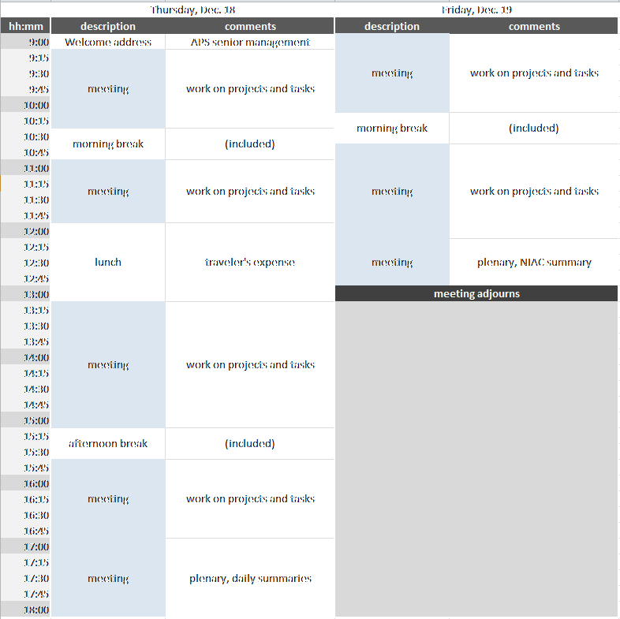

NIAC2014 Meeting
================

NIAC Meeting
------------

This is a meeting for members of the NeXus International Advisory
committee and other interested persons. It generally discusses matters
of policy and strategy, but can discuss specific NeXus instrument
definitions if the relevant experts are in attendance.

See [NIAC2014](NIAC2014.html "wikilink") for administrative details about
this meeting.

### Schedule

The NIAC2014 Meeting takes place in building 437, conference room C010,
starting at 9am. Evening meal is planned for 7 pm each day.

Notes:

1.  amenities at morning and afternoon breaks will be provided
2.  breakfast, lunch, dinner will be in a local restaurant at traveler's
    expense

### Items for Agenda

-   Votes on new members
-   Electing new officers, candidates get ready!
-   Revise Constitution [ Terms of Reference](NIAC.html#Terms_of_Reference "wikilink"):
    -   item 3: change wording of “instrument and group class
        definitions” to contemporary terms (base classes and instrument
        definitions)
-   Examination of contributed definitions and consideration for
    ratification:
    -   joint CIF/NeXus NXmx
    -   NXarpes
    -   NXcanSAS
    -   NXcite
    -   NXgrating
    -   NXstxm
    -   NXtransformations
    -   NXzone\_plate
    -   others ...
-   Deprecation of NeXus polar coordinate system, NXgeometry?
-   Do we want better standardization and documentation of NeXus
    processes?
-   Discussion about how we assign priorities and respond to the
    community
-   Do we want NeXus Interfaces for improving base class documentation?
-   application definitions: can some items be optional?
-   Data Features (lightweight tags with recipes) versus application
    definitions?
-   Rules for multi file NeXus files
-   NXdata:
    -   proposal: describe [ how to find the default
        data](2014_How_to_find_default_data.html "wikilink")
    -   proposal: describe how data are related (particularly: [ axes
        and uncertainties](2014_axes_and_uncertainties.html "wikilink"))
-   NXformula
-   [Update for NXflou application
    definition](Update_for_NXflou_application_definition.html "wikilink")

### NIAC Agenda

#### Thursday

- Introduction - Confirmation of new members

-   Coffee

- Ratifications

-   NXmx
-   Deprecate old positioning schemes
-   Axes & Errors

- Lunch

- Ratifications

-   NXstxm
-   NXfluo
-   Contributed definitions
-   NXformula
-   optional fields in application definitions
-   sequence\_index
-   Thumbnail storage
-   Finding default data
-   Features

#### Friday

-   NeXus Procedures including Funding, certification etc.
-   Election of officers
-   Backlog from Thursday

1PM: NIAC terminates

### Minutes

#### Thursday Morning

Present members: as listed on [NIAC2014](NIAC2014.html "wikilink").

Welcome address by John Maclean (Acting Division Director for
Engineering Support).

Mark K introduction on activities since last meeting, including code
camp. As well as proposed list of topics and agenda. (SLIDES?)

Agenda approved as above.

New Members approved (all in favour):

-   Mark Basham for Diamond
-   Tobias Richter for ESS
-   Claudio Ferrero for ESRF

NXmx, NXtransformations and variants accepted as proposed (all in
favour).

NXgeometry deprecated - manual expresses warning not to use in the
future (all in favour).

polar\_angle and azimuthal\_angle stay unannotated in the manual (1
abstain, 1 against).

CIF style marked as preferred method for expressing geometry in the
manual (1 abstain).

Presentation on multidimensional axes by Pete Jemian.

Coffee break.

Vote on proposal for NXdata axes with indices attribute only required
when required to resolve ambiguity. All in favour. Vote on proposal with
indices required as in
[2014\_axes\_and\_uncertainties](2014_axes_and_uncertainties.html "wikilink").
Accepted: 9 in favour. Strong disagreement by Ray Osborn as adoption is
noted: “Adoption of NeXus will be hampered by additional complexity
being required unnecessarily”. Ben Watts would like to add that the
default plot in NXdata should be simple and not contain more data than
required. He may make a proposal at that end in future.

Eugen clarified the preference to use arrays where possible to avoid
string parsing. No objections. Proposal amended.

Pete Jemian presenting proposal for uncertainties. No agreement on best
way forward. All three possibilities (*field*\_uncertainties, attribute
to field, and attribute to parent group) all have pros and cons. We
reserve all schemes and explore further. NIAC will see a proposal when
experience has been gained with all variations.

Lunch

#### Thursday afternoon

Ratification of new and amended base classes and definitions.

NXfluo
[Update\_for\_NXflou\_application\_definition](Update_for_NXflou_application_definition.html "wikilink")
Resolution: Proposal is in agreement with existing scan rules. No vote
required. Further amendments to the application definition may be
required, but that needs to be refined. Mark B and Eugen W will work on
that.

NXapres: Unanimously accepted in the current form in
contributed\_definitions.

NXstxm: Accepted as proposed (lives in development branch on definitions
repo on github). (all in favour)

NXcite: Accepted with the addition of URL field. (unanimous)

NXfresnel\_zone\_plate: Accepted under proviso that the NXgeometry is
removed. (unanimous)

Discussion of proposed muon classes in contributed. They need revision.
(no vote)

Clarification decision: By default values are readback values. If demand
values are to be recorded for consistency the recommended way of naming
the data field is to append \_set to the dataset name, as in energy\_set
for example. (6 in favour, 6 abstain)

Coffee break with generous supply of nibbles by our host. (Many thanks,
Pete!)

NXformula: Agreed as research project (no vote). No evaluation of
formula intended by consumer, use in documentation only. Will be
developed by Eugen. Use of attributes may be required to find formula
for data. muparser may or may not be sufficient.

NXgrating: Accepted as in development branch. Required revision of
NXmonochromator to go with that agreed (pending).

Optional fields in application definitions (minOccurs=0): All in favour
of allowing that.

sequence\_index to be added to NXprocess and NXnote to allow for
encoding a sequence of operations or notes. All in favour.

Discussion of preference on multiple NXprocess or few NXprocess with
NXnotes inside. No consensus. Will allow the community to gain more
experience.

Adding “default” attribute at root and entry level in order to find
default NXentry and NXdata for plotting. All in favour.

Providing thumbnails for OS support. Accepted for exploration at NXroot
level.

Research Projects

NeXus features (presented by Tobias and Mark B): All in favour of that
effort. Validation in python seen as good approach. NXmx good first
target, because existing validation fails. Muons will be interested.
Needs some more ground work and documentation before giving the word
out. Integration with NeXpy promising. “features” reserved in NXentry.
All in favour.

Interfaces (presented by Mark K): Works in a similar way for base
classes what features do at a higher level (NXentry). Presentation well
received. No motion, no vote.

Ray reports on effort for pyro for remote access of NeXus files in
NeXpy.

No backlog from this day.

Ben reports on acquisition with decimated counts. Adding “decimated” to
acquisition\_mode in NXdetector would help. All in favour.

Adding “nominal” to NXmonitor would help normalising data to a nominal
flux for example. Proposed and accepted (2 abstain).

“rgbimage”, “rgbaimage”, “hslimage”, “hslaimage”, “cmykimage” to be
added to the interpretation attribute of datasets to encode 3d datasets
with colour as added dimension to the 2d image. Improve documentation as
well. All in favour.

Introduction to tomorrow's topics.

Vote on changing the constitution to agree with current terms
(application definition and base class). All in favour.

Vote on removing the Procedures section of the Constitution since it was
never actually in use. All in favour. Wiki changed in line with both
proposals.

Dinner proposed and accepted.

#### Friday Morning

Procedural questions.

Robert's rule to be followed for setting agenda. All in favour (1
abstain).

Action for next chairmen to contact detector vendors and invite them to
discussions in order not to give the perception that the NIAC
relationship to Dectris is in any way special. All in favour.

Proposal to open nexus-tech discussions to everyone. Mailing list
traffic to be channeled to the general mailing list (or the committee).
Hangout open all interested parties (vendors, non-members). All in
favour.

Funding. Discussion on how money could help to improve NeXus adoption.
No strong case made for continuous funding for tutorials, developers or
meetings. Topical funding for tutorials at specific meetings is seen as
a good idea. Herbert will look into that.

Mark B to investigate a review of NeXus by the [Software Sustainability
Institute](http://www.software.ac.uk) in their next proposal cycle.

Coffee

Election of Officers

Mark K comes to the end of his second term as chair and cannot stand
again.

-   Chair: Tobias elected (1 abstain)
-   Executive Secretary: Mark K elected (1 abstain)
-   Documentation Release Manager: Pete Jemian reelected (1 abstain)
-   Technical Manager: Eugen Wintersberger (2 abstain)

All in favour of renaming the Technical Subcommittee Chair role to
Technical Manager.

Group photo

Ray suggests using the wiki for voting. No general agreement. Record
keeping of email and presence votes is not ideal currently. Committing
data to a repo might be an idea. Other suggestions were use of forum
software.

The secretary is tasked with exploring options to improve voting
processes and recording. (1 abstain)

Many thanks to the kind host. The committee thanks the outgoing
officers. Meeting concluded.
