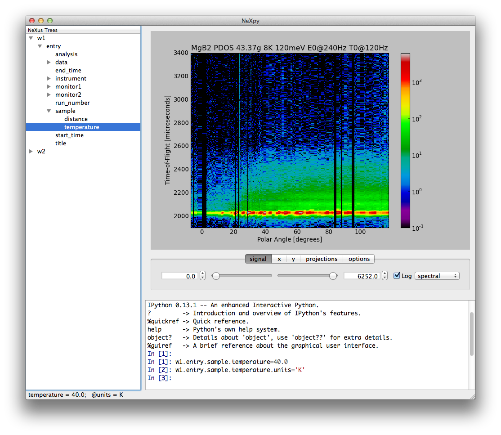

NeXpy
=====

[NeXpy](https://nexpy.github.io/nexpy/) provides a high-level python interface to NeXus data contained
within a simple GUI. It is designed to provide an intuitive interactive
toolbox allowing users both to access existing NeXus files and to create
new NeXus-conforming data structures without expert knowledge of the
file format.

Installation
------------

WARNING: NeXpy is in the early stages of development, and so there has
been no stable release yet. It is available for testing purposes only.

To check out the latest version from the [GitHub
repository](https://github.com/nexpy/nexpy) and install the NeXpy
package to the standard python site-packages directory,:

`> git clone `[`https://github.com/nexpy/nexpy.git`](https://github.com/nexpy/nexpy.git)  
`> cd nexpy`  
`> python setup.py install`

This assumes that the standard Python script directory is in your
default path.

The source code can also be viewed on the [NeXpy
GitHub](https://github.com/nexpy/nexpy).

### Installation Issues

#### Locating the NeXus library

NeXpy utilizes the python wrapper to the NeXus C API distributed with
the standard NeXus distribution. This wrapper needs the location of the
libNeXus precompiled binary. It looks in the following places in order::

<table>
<colgroup>
<col width="50%" />
<col width="50%" />
</colgroup>
<thead>
<tr class="header">
<th>
Location
</th>
<th>
Operating System
</th>
</tr>
</thead>
<tbody>
<tr class="odd">
<td>
os.environ['NEXUSLIB']
</td>
<td>
All
</td>
</tr>
<tr class="even">
<td>
directory containing napi.py
</td>
<td>
All
</td>
</tr>
<tr class="odd">
<td>
os.environ['NEXUSDIR']\bin
</td>
<td>
Windows
</td>
</tr>
<tr class="even">
<td>
os.environ['LD_LIBRARY_PATH']
</td>
<td>
Unix
</td>
</tr>
<tr class="odd">
<td>
os.environ['DYLD_LIBRARY_PATH']
</td>
<td>
Darwin
</td>
</tr>
<tr class="even">
<td>
PREFIX/lib
</td>
<td>
Unix and Darwin
</td>
</tr>
<tr class="odd">
<td>
/usr/local/lib
</td>
<td>
Unix and Darwin
</td>
</tr>
<tr class="even">
<td>
/usr/lib
</td>
<td>
Unix and Darwin
</td>
</tr>
<tr class="odd">
</tr>
</tbody>
</table>

-   On Windows it looks for one of libNeXus.dll or libNeXus-0.dll.
-   On OS X it looks for libNeXus.dylib
-   On Unix it looks for libNeXus.so

NEXUSDIR defaults to r'C:\\Program Files\\NeXus Data Format'. PREFIX
defaults to /usr/local, but is replaced by the value of --prefix during
configure.

The import will raise an OSError exception if the library wasn't found
or couldn't be loaded. Note that on Windows in particular this may be
because the supporting HDF5 dlls were not available in the usual places.

If you are extracting the nexus library from a bundle at runtime, set
os.environ\['NEXUSLIB'\] to the path where it is extracted before the
first import of nexpy.

#### Required Libraries

-   [nexus](http://www.nexusformat.org)
-   [numpy](https://numpy.org)
-   [scipy](https://scipy.org)
-   [h5py](https://www.h5py.org)
-   [matplotlib v1.1.0](http://matplotlib.sourceforge.net)
-   [hdf5](http://www.hdfgroup.org)
-   [mxml](http://www.minixml.org) (XML NeXus files only)
-   [PySide v1.1.0](http://www.pyside.org/) (GUI only)
-   [iPython v0.13](http://ipython.org/) (GUI only)
-   [pyspec](http://pyspec.sourceforge.net) (SPEC reader only)

Running NeXpy
-------------

There are two ways of using the NeXpy interface to NeXus files.

1.  Within a standard python or ipython shell.
2.  Using the GUI shell

### Python Shell

`$ python`  
`Python 2.7.2 (default, Oct 11 2012, 20:14:37) `  
`[GCC 4.2.1 Compatible Apple Clang 4.0 (tags/Apple/clang-418.0.60)] on darwin`  
`Type `“`help`”`, `“`copyright`”`, `“`credits`”` or `“`license`”` for more information.`  
`>>> from nexpy.api import nexus`  
`>>> a=nexus.load('data/chopper.nxs')`

### GUI Shell

To run the NeXpy GUI, type

`> nexpy`

 The GUI
contains three main panes:

Tree Pane:This contains the tree structure of NeXus files opened in the File menu and/or any NXroot and NXentry groups created within the shell.  
Plot Pane:Any NXdata or NXmonitor group can be plotted in this pane by right-clicking on the relevant node in the tree.  
Shell Pane:This is a regular python shell, with both Numpy and NeXpy already imported (as \* so no prefixes are necessary). Any assignments to items in the tree pane are automatically reflected in the tree pane, and new NXroot, NXentry, or NXdata objects are added to the tree. Currently, it is not possible to plot directly from the shell pane, but this will be added in the future.  

There are a number of useful features available when running NeXpy
within the GUI shell.

1.  Data can be loaded with the <File:Open> menu item using a standard
    file browser window.
2.  All current NeXus data trees are easy to inspect in the pane on the
    upper left side. Hovering over a data item produces a tooltip
    containing a list of all the item's children.
3.  Newly created group can be added to the tree at any time.
4.  Any changes to data sets in the scripting window will be reflected
    within the tree pane, including the creation of new NXroot or
    NXentry groups.
5.  NXdata and NXmonitor plots can be displayed by right-clicking and
    choosing 'Plot'.
6.  Axis limits are set by a series of slider bars.
7.  The scripting shell provides convenient autocompletion, and
    automatically displays function docstrings as a tooltip when you
    open the function parentheses.

#### Planned Enhancements

-   Editing data items in the tree within an editor pane.

NeXus Interface
---------------

### Loading NeXus Data

The entire tree structure of a NeXus file can be loaded by a single
command.

`>>> from nexpy.api import nexus`  
`>>> a=nexus.load('sns/data/ARCS_7326_tof.nxs')`

The assigned variable now contains the entire tree structure of the
file, which can be displayed by printing the 'tree' property.

`>>> print a.tree`  
`root:NXroot`  
` @HDF5_Version = 1.8.2`  
` @NeXus_version = 4.2.1`  
` @file_name = ARCS_7326_tof.nxs`  
` @file_time = 2010-05-05T01:59:25-05:00`  
` entry:NXentry`  
`   `[`data:NXdata`](data:NXdata)  
`     data = float32(631x461x4x825)`  
`       @axes = rotation_angle:tilt_angle:sample_angle:time_of_flight`  
`       @signal = 1`  
`     rotation_angle = float32(632)`  
`       @units = degree`  
`     sample_angle = [ 210.  215.  220.  225.  230.]`  
`       @units = degree`  
`     tilt_angle = float32(462)`  
`       @units = degree`  
`     time_of_flight = float32(826)`  
`       @units = microsecond`  
`   run_number = 7326`  
`   sample:NXsample`  
`     pulse_time = 2854.94747365`  
`       @units = microsecond`

Individual data items are immediately available from the command-line.

`>>> print a.entry.run_number`  
`7326`

Note that only the tree structure and smaller data sets are read into
memory to avoid using up memory unnecessarily. In the above example,
only the types and dimensions of the larger data sets are displayed in
the tree. However, the filename is also stored, so the data can be
loaded as soon as it is needed, either as a complete array or as a
series of slabs.

### Creating NeXus Data

It is just as easy to create new NeXus data sets from scratch using
Numpy arrays. The following example shows the creation of a simple
function, which is then saved to a file.

`>>> import numpy as np`  
`>>> x=y=np.linspace(0,2*np.pi,101)`  
`>>> X,Y=np.meshgrid(x,y)`  
`>>> z=np.sin(X)*np.sin(Y)`  
`>>> a=NXdata(z,[x,y])`  
`>>> a.save('function.nxs')`

This file can then be loaded again.

`>>> b=nexus.load('function.nxs')`  
`>>> print b.tree`  
`root:NXroot`  
` @HDF5_Version = 1.8.2`  
` @NeXus_version = 4.2.1`  
` @file_name = function.nxs`  
` @file_time = 2010-05-10T17:01:13+01:00`  
` entry:NXentry`  
`   `[`data:NXdata`](data:NXdata)  
`     axis1 = float64(101)`  
`     axis2 = float64(101)`  
`     signal = float64(101x101)`  
`       @axes = axis1:axis2`  
`       @signal = 1`

Note that the save() method automatically wraps any valid NeXus data in
an NXentry group, in order to produce a standard-compliant file.

#### NeXus Fields

NeXus data values are stored in NeXus objects of class 'NXfield'. The
NXfield class wraps standard Numpy arrays, scalars, and python strings
so that data attributes can be associated with them. There are two ways
to create an NXfield.

-   Explicit initialization. The data value is given by the first
    positional argument, and may be a python scalar or string, or a
    Numpy array. In this method, keyword arguments can be used to define
    NXfield attributes.

`>>> x = NXfield(np.linspace(0,2*np.pi,101), units='degree')`

-   Implicit initialization as the child of a NeXus group. The assigned
    values are automatically converted to an NXfield.

`>>> a.entry.sample.temperature=40.0`  
`>>> a.entry.sample.temperature`  
`NXfield(name=temperature,value=40.0)`

NXfield attributes can be assigned after creating the NXfield. Note that
attribute names must not start with 'nx' to avoid name clashes.

`>>> a.entry.sample.temperature.units='K'`

The actual values of an NXfield are stored in the 'nxdata' attribute. If
the NXfield is read in from a data file, this attribute is not input if
the array size is large to avoid using up memory unnecessarily. It will,
however, be read in if the value is accessed for plotting or
manipulating data. If this will cause a memory exception, the data
should be read in as a series of slabs using the nxget method.

`>>> with root.NXentry[0].data.data as slab:`  
`              Ni,Nj,Nk = slab.shape`  
`               size = [1,1,Nk]`  
`               for i in range(Ni):`  
`                   for j in range(Nj):`  
`                       value = slab.get([i,j,0],size)`

Data values can be returned converted to different units if the 'units'
attribute has been set.

`>>> phi = x.nxdata_as(units='radian')`  
`>>> y = NXfield(np.sin(phi))`

#### NeXus Groups

NeXus groups are defined as subclasses of the NXgroup class. Apart from
the class name, they behave identically except for the NXdata,
NXmonitor, and NXlog groups, which have extra methods defined. The
initialization parameters can be used to populate the group with other
predefined NeXus objects, either groups or fields.

`>>> temperature = NXfield(40.0, units='K')`  
`>>> sample = NXsample(temperature=temperature)`  
`>>> print sample.tree`  
`sample:NXsample`  
`  temperature = 40.0`  
`  units = K`

Note that, in this example, it was necessary to use the keyword form to
add the NXfield 'temperature' since its name is otherwise undefined
within the NXsample group. This name is set automatically if the NXfield
is added as an attribute assignment.

`>>> sample = NXsample()`  
`>>> sample.temperature=NXfield(40.0, units='K')`  
`sample:NXsample`  
`  temperature = 40.0`  
`  units = K`

The objects in NeXus groups, which can be NXfields or other NXgroups,
can also be assigned and referenced as dictionary items.

`>>> sample[`“`temperature`”`] = 40.0`  
`>>> sample.keys()`  
`['temperature']`

NXdata Groups  
NXdata groups contain data ready to be plotted. That means that the
group should consist of an NXfield containing the data and one or more
NXfields containing the axes. NeXus defines a method of associating axes
with the appropriate dimension, but NeXpy provides a simple constructor
that implements this method automatically.

This was already demonstrated in the example above, reproduced here:

`>>> import numpy as np`  
`>>> x=y=np.linspace(0,2*np.pi,101)`  
`>>> X,Y=np.meshgrid(y,x)`  
`>>> z=np.sin(X)*np.sin(Y)`  
`>>> a=NXdata(z,[x,y])`

  
The first positional argument is an NXfield or Numpy array containing
the data, while the second is a list containing the axes, again as
NXfields or Numpy arrays. In this example, the names of the arrays have
not been defined within an NXfield so default names were assigned.

`>>> print a.tree`  
`   `[`data:NXdata`](data:NXdata)  
`     axis1 = float64(101)`  
`     axis2 = float64(101)`  
`     signal = float64(101x101)`  
`       @axes = axis1:axis2`  
`       @signal = 1`

  
However, names can be assigned explicitly when creating the NXfield
through the 'name' attribute.

`>>> phi=np.linspace(0,2*np.pi,101)`  
`>>> data=np.sin(phi)`  
`>>> a=NXdata(NXfield(data,name='intensity'),(NXfield(phi,name='polar_angle')))`  
`>>> print a.tree`  
[`data:NXdata`](data:NXdata)  
`  intensity = float64(101)`  
`    @axes = polar_angle`  
`    @signal = 1`  
`  polar_angle = float64(101)`

### Adding NeXus Data to the Tree View

If you create a NeXus group dynamically in the iPython shell, it can be
added to the tree view using the tree's add method.

`>>> a=NXroot()`  
`>>> a.entry = NXentry()`  
`>>> tree.add(a)`

If the group is not an NXroot group, the data will be wrapped
automatically in an NXroot group and given a default name that doesn't
conflict with existing tree nodes, e.g., w4.

### Plotting NeXus Data

#### Python Shell

NXdata, NXmonitor, and NXlog groups all have a plot method, which
automatically determines what should be plotted.

`>>> data.plot()`

 If
the data is one-dimensional, it is possible to overplot more than one
data set using 'over=True'. Conventional Matplotlib keywords can be used
to change markers and colors.

`>>> data.plot(log=True)`  
`>>> data.plot(over=True, log=True, color='r')`

#### GUI Shell

NXdata, NXmonitor, and NXlog data can be plotted by right-clicking on
the group within the tree. The plot pane contains a toolbar to change
axis or signal intensity limits. The slider provides a graphical way of
setting minimum and/or maximum values or they can be typed into the text
boxes. 
There are two checkboxes:

Lock:If the maximum and/or minimum values are not set to the limits, then this checkbox locks the difference between the two. This checkbox disables setting of the minimum value. You can step through the z-values with automatic replots by selecting the maximum box and using the keyboard up and down arrows or by clicking the box arrows.  
Autoscale: When stepping through the z-values, this checkbox determines whether the plot should change the color scale.  

### Manipulating NeXus Data

### Slicing

#### NXfield

A slice of an NXfield can be obtained using the usual python indexing
syntax.

`>>> x=NXfield(np.linspace(0,2*np.pi,101))`  
`>>> print x[0:51]`  
`[ 0.          0.06283185  0.12566371 ...,  3.01592895  3.0787608 3.14159265]`

If either of the indices are floats, then the limits are set by the
values themselves (assuming the array is monotonic).

`>>> print x[0.5:1.5]`  
`[ 0.50265482  0.56548668  0.62831853 ...,  1.38230077  1.44513262 1.50796447]`

#### NXdata

It is also possible to slice whole NXdata groups. In this case, the
slicing works on the multidimensional NXfield, but the full NXdata group
is returned with both the signal data and the associated axes limited by
the slice parameters. If either of the limits along any one axis is a
float, the limits are set by the values of the axis.

`>>> a=NXdata(np.sin(x),x)`  
`>>> a[1.5:2.5].x`  
`NXfield(name=x,value=[ 1.57079633  1.72787596  1.88495559 ...,  2.19911486  2.35619449])`

Unless the slice reduces one of the axes to a single item, the rank of
the data remains the same. To project data along one of the axes, and so
reduce the rank by one, the data can be summed along that axis using the
nxsum() method. This employs the Numpy array sum() method.

`>>> x=y=NXfield(np.linspace(0,2*np.pi,41))`  
`>>> X,Y=np.meshgrid(x,y)`  
`>>> a=NXdata(np.sin(X)*np.sin(Y), (x,y))`  
`>>> print a.tree`  
[`data:NXdata`](data:NXdata)  
`  axis1 = float64(41)`  
`  axis2 = float64(41)`  
`  signal = float64(41x41)`  
`    @axes = axis1:axis2`  
`    @signal = 1`  
`>>> print a.sum(0).tree`  
[`data:NXdata`](data:NXdata)  
`  axis2 = float64(41)`  
`  signal = float64(41)`  
`    @axes = axis2`  
`    @long_name = Integral from 0.0 to 6.28318530718 `  
`    @signal = 1`

It is also possible to slice whole NXdata groups. In this case, the
slicing works on the multidimensional NXfield, but the full NXdata group
is returned with both the signal data and the associated axes limited by
the slice parameters. If either of the limits along any one axis is a
float, the limits are set by the values of the axis.

`>>> a=NXdata(np.sin(x),x)`  
`>>> a[1.5:2.5].x`  
`NXfield(name=x,value=[ 1.57079633  1.72787596  1.88495559 ...,  2.19911486  2.35619449])`

Unless the slice reduces one of the axes to a single item, the rank of
the data remains the same. To project data along one of the axes, and so
reduce the rank by one, the data can be summed along that axis using the
nxsum() method. This employs the Numpy array sum() method.

`>>> x=y=NXfield(np.linspace(0,2*np.pi,41))`  
`>>> X,Y=np.meshgrid(x,y)`  
`>>> a=NXdata(np.sin(X)*np.sin(Y), (x,y))`  
`>>> print a.tree`  
[`data:NXdata`](data:NXdata)  
`  axis1 = float64(41)`  
`  axis2 = float64(41)`  
`  signal = float64(41x41)`  
`    @axes = axis1:axis2`  
`    @signal = 1`  
`>>> print a.sum(0).tree`  
[`data:NXdata`](data:NXdata)  
`  axis2 = float64(41)`  
`  signal = float64(41)`  
`    @axes = axis2`  
`    @long_name = Integral from 0.0 to 6.28318530718 `  
`    @signal = 1`

### Arithmetic Operations

#### NXfield

Arithmetic operations can be applied to NXfield objects in much the same
way as scalars or Numpy arrays that they contain. This includes
addition, subtraction, multiplication and division, either with other
NXfield objects or to scalar numbers or Numpy arrays.

`>>> x=NXfield(array((1.5,2.5,3.5),name='x')`  
`>>> x`  
`NXfield(name=x,value=[ 1.5  2.5  3.5])`  
`>>> x+1`

NXfield(name=x,value=\[ 2.5 3.5 4.5\])

`>>> 2*x`  
`NXfield(name=x,value=[ 3.  5.  7.])`  
`>>> x+x`  
`NXfield(name=x,value=[ 3.  5.  7.])`  
`>>> x-x`  
`NXfield(name=x,value=[ 0.  0.  0.])`  
`>>> x/x`  
`NXfield(name=x,value=[ 1.  1.  1.])`

#### NXdata

Similar operations can also be performed on whole NXdata groups. If two
NXdata groups are to be added, the rank and dimension sizes of the main
signal array must match (although the names could be different).

`>>> y=NXfield(np.sin(x),name='y')`  
`>>> y`  
`NXfield(name=y,value=[ 0.99749499  0.59847214 -0.35078323])`  
`>>> a=NXdata(y,x)`  
`>>> print a.tree`  
[`data:NXdata`](data:NXdata)  
`  x = [ 1.5  2.5  3.5]`  
`  y = [ 0.99749499  0.59847214 -0.35078323]`  
`    @axes = x`  
`    @signal = 1`  
`>>> print (a+1).tree`  
[`data:NXdata`](data:NXdata)  
` x = [ 1.5  2.5  3.5]`  
` y = [ 1.99749499  1.59847214  0.64921677]`  
`   @axes = x`  
`   @signal = 1`  
`>>> print (2*a).tree`  
[`data:NXdata`](data:NXdata)  
`  x = [ 1.5  2.5  3.5]`  
`  y = [ 1.99498997  1.19694429 -0.70156646]`  
`    @axes = x`  
`    @signal = 1`  
`>>> print (a+a).tree`  
[`data:NXdata`](data:NXdata)  
`  x = [ 1.5  2.5  3.5]`  
`  y = [ 1.99498997  1.19694429 -0.70156646]`  
`    @axes = x`  
`    @signal = 1`  
`>>> print (a-a).tree`  
[`data:NXdata`](data:NXdata)  
`  x = [ 1.5  2.5  3.5]`  
`  y = [ 0.  0.  0.]`  
`    @axes = x`  
`    @signal = 1`  
`>>> print (a/2).tree`  
[`data:NXdata`](data:NXdata)  
`  x = [ 1.5  2.5  3.5]`  
`  y = [ 0.49874749  0.29923607 -0.17539161]`  
`    @axes = x`  
`    @signal = 1`

If data errors are included in the NXdata group (with an additional
array named 'errors'), then the errors are propagated according to the
operand.

`>>> print a.tree`  
[`data:NXdata`](data:NXdata)  
`  errors = [ 0.99874671  0.77360981  0.59226956]`  
`  x = [ 1.5  2.5  3.5]`  
`  y = [ 0.99749499  0.59847214  0.35078323]`  
`    @axes = x`  
`    @signal = 1`  
`>>> print (a+a).tree`  
[`data:NXdata`](data:NXdata)  
`  errors = [ 1.41244114  1.09404949  0.83759564]`  
`  x = [ 1.5  2.5  3.5]`  
`  y = [ 1.99498997  1.19694429  0.70156646]`  
`    @axes = x`  
`    @signal = 1`
