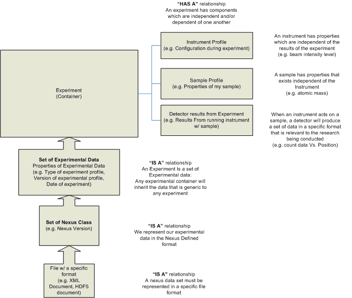
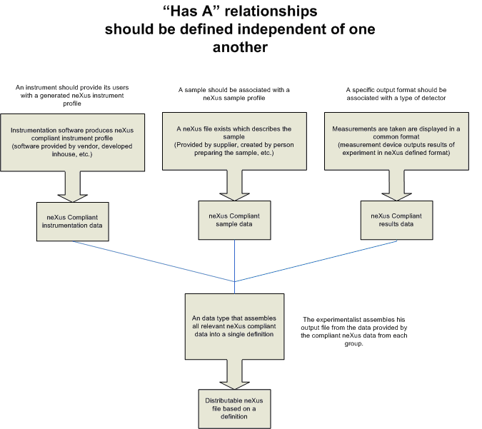
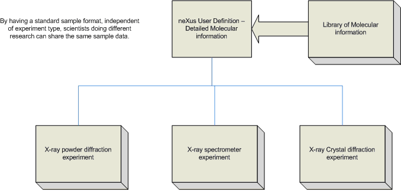
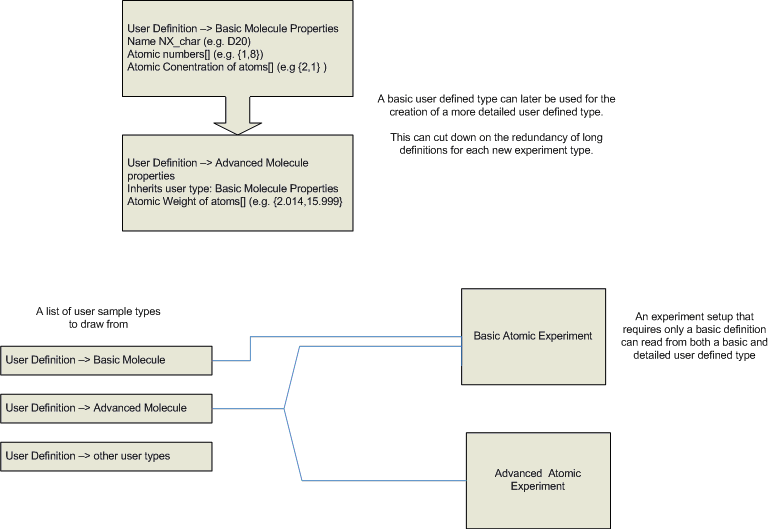

==========================
Containers and Inheritance
==========================

*Currently Under Construction - will be linked to the discussion page when reviewed and completed*
This page presents how neXus could benefit from an object/container-orientated approach to its user
defined instrument definitions. By allowing base user definitions for components, datasets from full
datasets can be expressed as a sum of components. The XSLT standard and XQuery are methods that can
possibly realize the extraction of data from one or more XML based neXus definition and create a new
neXus XML document as desired.

Relationship between Inheritance and Containers in a neXus dataset
------------------------------------------------------------------

Instrument definitions can be assembled in a multitude of ways using the neXus predefined classes.
An instrument definitions are most often is a superset of discrete components, with additional
information which that is general to all instrument definitions. The data contained in a data set can
be described via the has a/is a relationship encountered in object orientated programming. Traits that
are inherent to all data sets in the neXus format can be inherited from a parent class. This would be
an is a relation, as the data set is a set of neXus data, and has such properties. A dataset is also
a container, and thus contain small data subsets, usually base neXus classes. This is a has a
relationship, as a container has a data subset.

------------------------------------------------------------------------

What is of interest in this discussion is the has a relationship. A parent data set acts as a
container for many simpler datasets. If these subsets are specified independently, a greater deal of
compatibility and standardization can be achieved between software written by vendors, scientists
and engineers working on different aspects of a project. XLST, Xquery, or a similar XML transform
standard can be used to realize this type of conversion in practice. user-defined component types
can be shared amoung multiple experiment types.

---------------------------------------------------------------------------

Independent component definitions allow vastly different experiments to share common equipment or
data, without having to redefine the data type for each experiment. An equipment or data library
can have, in itself, a standard format. User-defined components can be inherited by more specific
user components.

-------------------------------------------------------------------------

Should additional data be needed for a more complicated equipment or data library, it can inherit
the previous definition, and add additional information. This allows experiments that only require
a basic component definition to also use datasets that have additional data appended.

--[Greg Sonnenfeld](User%3AGreg_Sonnenfeld.html "wikilink") 15:22, 27 January 2007 (UTC)
