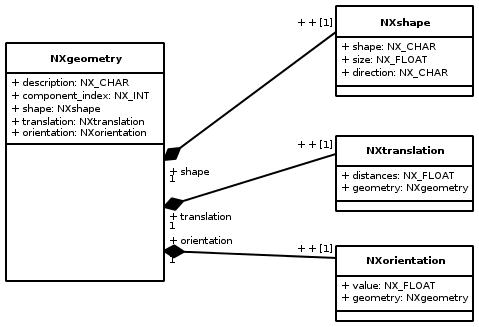
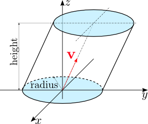
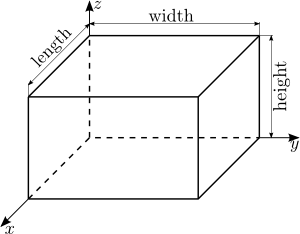
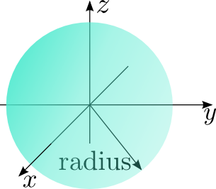
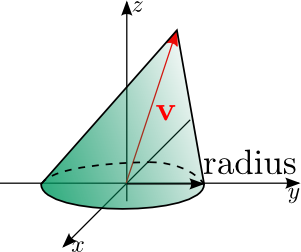
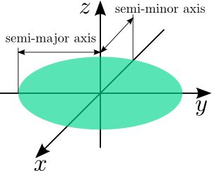
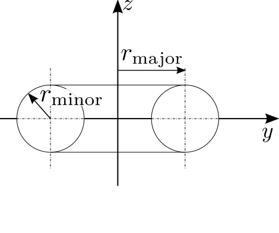
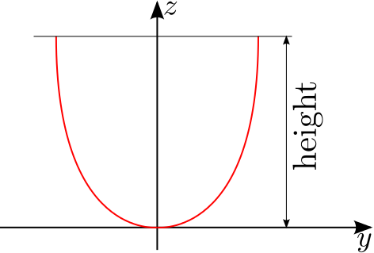
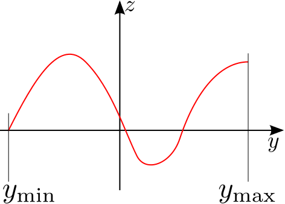

=================================================
NXgeometry and NXshape - documentation and review
=================================================

Geometries in Nexus are described using the
`NXgeometry <https://manual.nexusformat.org/classes/base_classes/NXgeometry.html>`_
base class. As shown in the UML diagram on the right side, this class
consists basically of three other base classes (composition): *NXshape*,
*NXtranslation*, and *NXorientation*. As far as I understand the
*NXgeometry* class, it describes a single shape (geometric object). This
fact makes the dimensionality of several attributes of the other
classes a bit odd (see below). However, aside from this, *NXgeometry* is
quite ok.

Note: the NeXus User Guide describes the coordinate system here:

- https://manual.nexusformat.org/design.html#nexus-coordinate-systems

NXtranslation
-------------

`NXtranslation <https://manual.nexusformat.org/classes/base_classes/NXtranslation.html>`_
has an attribute *distances* of shape ``[numobj,3]``. If, as stated above,
*NXgeometry* seems to describe only a single shape, the first dimension
has no meaning. A dimensionality of ``[3]`` would be enough for this
field.

NXorientation
-------------

`NXorientation <https://manual.nexusformat.org/classes/base_classes/NXorientation.html>`_
has an attribute *value* of shape ``[numobj,6]``. If, as stated above,
*NXgeometry* seems to describe only a single shape, the first dimension
has no meaning. A dimensionality of ``[6]`` would be enough for this
field.

NXshape
-------

`NXshape <https://manual.nexusformat.org/classes/base_classes/NXshape.html>`_

This is where all the problems start. In fact, there are three issues
with this class:

1. As for *NXtranslation* and *NXorientation*, the first dimension of
   the *size* attribute (``numobj``) has no meaning.
2. What is the attribute *direction* good for (its values *convex* and
   *concave* are not defined)?
3. Last but not least: the shapes are not defined well (this is the
   major issue).

The last problem will be discussed in more detail in the following
sections.

Definition of geometric primitives
----------------------------------

Every geometric primitive requires a local coordinate frame. All
translations applied on a primitive will act on the origin of this local
frame. Additionally, the origin of this frame of reference will act as a
center for all rotations applied on the primitive. Unfortunately, the 9
geometric primitives currently available in Nexus are not defined in
such a sense. The following sections provide some possible definitions
of these primitives along with the layout of their parameters stored in
the *size* attribute of *NXshape*.

.. image:: ../extra_files/Nxflat_image.png
   :alt: Shape and coordinate frame for an *nxflat*

nxflat
~~~~~~

*nxflat* can be considered as a flat plane. The plane defines the
x-y-plane of its local coordinate frame. The z-axis of this system is
oriented so that the resulting reference frame is a right-handed one.
The shape has two parameters: its *height* and *width*, which will be
stored in the *size* attribute of *NXshape* as follows:

``NXshape::size[2]={width,height}``

nxcylinder
~~~~~~~~~~

The origin of the local coordinate frame for *nxcylinder* is in the
center of its bottom. An *nxcylinder* has 5 parameters: radius, height,
and components of the direction vector v (see the figure
above). These parameters are stored in the *size* attribute of *NXshape*
as follows:

``NXshape::size[5]={radius,height,vx,vy,vz}``

v is here simply a unit vector pointing in the direction of the main
axis of the cylinder.

nxbox
~~~~~

``NXshape::size[3]={length,width,height}``

nxsphere
~~~~~~~~

``NXshape::size[1]={radius}``

nxcone
~~~~~~

Like for *nxcylinder*, the vector v is simply a unit vector pointing to the
tip of the cylinder (no direction cosines or something else fancy).

``NXshape::size[4]={radius,vx,vy,vz}``

nxelliptical
~~~~~~~~~~~~

``NXshape::size[2]={semi-major axis,semi-minor axis}``

I have no idea what the other two parameters *pole* and *angle of major
axis* are good for. Maybe we can drop them.

nxtoroidal
~~~~~~~~~~

``NXshape::size[2]={minor radius,major radius}``

nxparabolic
~~~~~~~~~~~

This is a poorly designed shape. Only the parabolic parameter *a* is
defined in the current documentation. I included here at least the
height of the parabola. However, it is indeed not clear whether or not
this should be a 2D object or a 3D object. We definitely have to discuss
this.

nxpolynomial
~~~~~~~~~~~~

Like *nxparabolic*, this shape is rather poorly designed. Besides the
coefficients of the polynomial, at least the bounds of the interval on
which the polynomial should be evaluated are required to define the
geometry. Also, like with *nxparabolic*, it is not clear if this is a 2D
or 3D object - both would be possible. We need to define this more
thoroughly.

Update 01/2015
--------------

At NIAC 2014, it was decided to deprecate *NXgeometry*. But this can still
serve to document *NXgeometry* better.