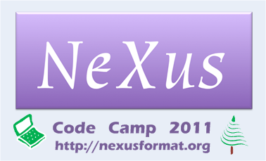

=================
NIAC2011 CodeCamp
=================

.. container:: content

   .. container:: page

      .. rubric:: NIAC2011 CodeCamp
         :name: NIAC2011_CodeCamp_niac2011-codecamp
         :class: page-title

      |logo for the 2011 NeXus Code Camp|

      .. rubric:: Purpose
         :name: NIAC2011_CodeCamp_purpose

      Develop NeXus software components through intense effort by small
      groups working on specific projects and tasks. It is expected that
      those attending the 2011 NeXus Code Camp will already have strong
      foundation and understanding in aspects of the NeXus software and
      come ready with knowledge, tools, and ideas to make significant
      progress during the event. The specific projects and tasks, as
      well as the list of participants, are described on this wiki and
      will be revised as the event draws near.

      See previous NeXus Code Camps:

      -  http://www.nexusformat.org/NIAC2010_CodeCamp
      -  http://www.nexusformat.org/index.php?title=NIAC2009

      .. rubric:: Dates
         :name: NIAC2011_CodeCamp_dates

      -  2011 October 20-22 (Thursday - Saturday)

      .. rubric:: Daily Agenda
         :name: daily-agenda

      Meeting room is Building 401, Room B2100

      .. rubric:: Thursday, 2011 October 20
         :name: NIAC2011_CodeCamp_thursday-2011-october-20

      +---------------------+----------------------+----------------------+
      | time                | description          | comments             |
      +=====================+======================+======================+
      | 9:00 - 10:15 AM     | meeting              | organize slate of    |
      |                     |                      | projects and tasks   |
      +---------------------+----------------------+----------------------+
      | 10:15 - 10:45 AM    | morning break        | (included)           |
      +---------------------+----------------------+----------------------+
      | 10:45 AM - 12:00 PM | meeting              | work on projects and |
      |                     |                      | tasks                |
      +---------------------+----------------------+----------------------+
      | 12:00 - 1:15 PM     | **Comparison of APS  | (\*) working lunch   |
      |                     | Data_Exchange+HDF5   | onsite, hosted by    |
      |                     | for Tomography with  | APS, 401/B2100       |
      |                     | NeXus+HDF5**         |                      |
      +---------------------+----------------------+----------------------+
      | 1:15 - 3:15 PM      | meeting              | work on projects and |
      |                     |                      | tasks                |
      +---------------------+----------------------+----------------------+
      | 3:15 - 3:30 PM      | afternoon break      | (included)           |
      +---------------------+----------------------+----------------------+
      | 3:30 - 5:00 PM      | meeting              | work on projects and |
      |                     |                      | tasks                |
      +---------------------+----------------------+----------------------+
      | 5:00 - 6:00 PM      | meeting              | daily summary        |
      |                     |                      | (plenary)            |
      +---------------------+----------------------+----------------------+

      (\*) speakers for the working lunch include:

      -  Chris Jacobsen, APS (scientific lead, APS Data Exchange format)
         |image1|
      -  Mark Koennecke, PSI (NeXus, chairman of NIAC)

      .. rubric:: Friday, 2011 October 21
         :name: NIAC2011_CodeCamp_friday-2011-october-21

      +---------------------+----------------------+----------------------+
      | time                | description          | comments             |
      +=====================+======================+======================+
      | 9:00 - 10:15 AM     | meeting              | work on projects and |
      |                     |                      | tasks                |
      +---------------------+----------------------+----------------------+
      | 10:00 - 10:30 AM    | morning break        | (included)           |
      +---------------------+----------------------+----------------------+
      | 10:30 AM - 11:30 PM | **The Current State  | public talk,         |
      |                     | of NeXus**           | 401/A1100            |
      +---------------------+----------------------+----------------------+
      | 12:00 - 1:15 PM     | lunch                | offsite, traveler"s  |
      |                     |                      | expense              |
      +---------------------+----------------------+----------------------+
      | 1:15 - 3:15 PM      | meeting              | work on projects and |
      |                     |                      | tasks                |
      +---------------------+----------------------+----------------------+
      | 3:15 - 3:30 PM      | afternoon break      | (included)           |
      +---------------------+----------------------+----------------------+
      | 3:30 - 5:00 PM      | meeting              | work on projects and |
      |                     |                      | tasks                |
      +---------------------+----------------------+----------------------+
      | 5:00 - 6:00 PM      | meeting              | daily summary        |
      |                     |                      | (plenary)            |
      +---------------------+----------------------+----------------------+

      .. rubric:: Saturday, 2011 October 22
         :name: saturday-2011-october-22

      =================== =============== ===========================
      time                description     comments
      =================== =============== ===========================
      9:00 - 10:15 AM     meeting         work on projects and tasks
      10:15 - 10:45 AM    morning break   (included)
      10:45 AM - 12:00 PM meeting         work on projects and tasks
      12:00 - 1:15 PM     lunch           offsite, traveler"s expense
      1:15 - 3:15 PM      meeting         work on projects and tasks
      3:15 - 3:30 PM      afternoon break (included)
      3:30 - 5:00 PM      meeting         work on projects and tasks
      5:00 - 6:00 PM      meeting         Code Camp wrap-up (plenary)
      =================== =============== ===========================

      .. rubric:: Planning
         :name: planning

      .. rubric:: Business Matters
         :name: NIAC2011_CodeCamp_business-matters

      Since this is not to be a meeting of the full NIAC, no business
      matters can be resolved.

      .. rubric:: Projects and Tasks
         :name: NIAC2011_CodeCamp_projects-and-tasks

      These items are sorted in order of priority that they be finished.
      Only items that currently exist in the project plan are being
      worked on.

      #. move to using 1.8 version of **HDF5** API (would allow HDF5
         transparent external linking)
      #. NXclonehandle
      #. PyTree API
      #. discuss axes for multi dimensional scans
      #. discuss axis dependency encoding
      #. discuss and decide switch to CMake for building NeXus
      #. discuss and decide on the use of sphinx for documentation
      #. Design NXdict replacement based on NXDL
      #. Improve nxvalidate
      #. Link NeXus WWW-site with docbook manual
      #. A Fedora installer
      #. Discuss and write NeXus for the Impatient
      #. Cleanup NeXus applications

      .. rubric:: Other Tasks
         :name: other-tasks

      Items not currently on the project plan, but have arisen recently:

      #. support for more than one unlimited array dimension
         (http://trac.nexusformat.org/code/ticket/258)
      #. support larger dataset dimensions (currently dimensions are
         "int" so overflow at > 2^31 elements)

      .. rubric:: Presentations
         :name: NIAC2011_CodeCamp_presentations

      #. presentation about **cmake** (Freddie Akeroyd or Pete Peterson)
      #. about **sphinx** for documentation (Pete Jemian) |PDF|
      #. about **parallel HDF** (Mark Koennecke, anyone else with more
         experience?)
      #. assessment of work to migrate from HDF 1.6 to HDF 1.8 (Freddie
         Akeroyd)
      #. public talk: **The Current State of NeXus**, Building 401, Room
         A1100, Friday, Oct. 21, 10:30 - 11:30 AM
      #.  

      .. rubric:: Schedule
         :name: NIAC2011_CodeCamp_schedule

      -  arrive the previous day (Wednesday, 2011-10-19)
      -  conference check-in first morning (Thursday, 2011-10-20),
         401-B2100
      -  meet all day (Thursday), 401-B2100
      -  meet all day (Friday), 401-B2100
      -  meet all day (Saturday), 401-B2100
      -  checkout next day (Sunday, 2011-10-23)

      Meeting room is Building 401, Room B2100

      Here is the daily schedule (tentative):

      =================== =============== ===========================
      time                description     comments
      =================== =============== ===========================
      9:00 - 10:15 AM     meeting         work on projects and tasks
      10:15 - 10:45 AM    morning break   (included)
      10:45 AM - 12:00 PM meeting         work on projects and tasks
      12:00 - 1:15 PM     lunch           offsite, traveler"s expense
      1:15 - 3:15 PM      meeting         work on projects and tasks
      3:15 - 3:30 PM      afternoon break (included)
      3:30 - 5:00 PM      meeting         work on projects and tasks
      5:00 - 6:00 PM      meeting         daily summary (plenary)
      =================== =============== ===========================

      Notes:

      #. late-afternoon wrap-up (plenary) each day
      #. morning and afternoon breaks will be included in amenities
         charge
      #. breakfast, lunch, dinner will be in a local restaurant at
         traveler"s expense

      .. rubric:: Practical Matters
         :name: NIAC2011_CodeCamp_practical-matters

      .. rubric:: Registration
         :name: NIAC2011_CodeCamp_registration

      | Step 1: Register with the APS as a visitor to start the process.
      | Step 2: Send an email to jemian@anl.gov announcing your plan to
        attend.

      .. rubric:: APS Visitor registration
         :name: NIAC2011_CodeCamp_aps-visitor-registration

      web site:
      https://www.aps.anl.gov/About/Visiting/visitor_registration.php

      You must register as an APS Visitor in advance (to identify
      matters related to Passport, Visa, and ANL Site Access) or you
      should not expect access to the ANL site. If asked, indicate that
      you are visiting *Pete Jemian*.

      For the paperwork of all international visitors, we need each
      degree, year earned, and institution name. Additionally for
      certain visas, we need additional information:

      | F1 visa: we need the I-20 number and expiration date.
      | J1 visa: we need the DS-2019 number and expiry date.
      | H1 visa: we need the I797 number and expiry date.

      .. rubric:: Venue
         :name: NIAC2011_CodeCamp_venue

      | Argonne Guest House
      | Argonne National Laboratory
      | 9700 S. Cass Avenue - Building 460
      | Argonne, IL 60439
      | USA

      Please reserve your own rooms directly with the hotel:

      | Web site: http://www.anlgh.org/
      | telephone: +1 - 800-632-8990, +1 - 630-739-6000
      | fax: +1 - 630-739-1000
      | map link:
        http://maps.google.com/maps?q=Argonne+Guest+House&hl=en&ll=41.708228,-87.985897&spn=0.024798,0.049953&sll=37.0625,-95.677068&sspn=27.008217,51.152344&t=h&z=14

      .. rubric:: Directions and Maps
         :name: NIAC2011_CodeCamp_directions-and-maps

      -  map to hotel:  
      -  airport:

         -  Chicago O"Hare (ORD): international
         -  Chicago Midway (MDW): domestic
         -  Milwaukee, WI Mitchell Field (MKE): distant alternative

      -  taxi:

         -  Call for a taxi pickup only after you have all your bags
         -  Must be a taxi that goes to Chicago suburbs
         -  suburban taxi will pickup in second lane of arrivals at
            Chicago O"Hare airport
         -  http://www.americantaxi.com, 1-800-244-1177 (automated
            system)
         -    others  

      -  airport bus: http://www.airportexpress.com/shuttles/ohare.html
      -  commuter train:

         -  inconvenient

      .. rubric:: Host
         :name: NIAC2011_CodeCamp_host

      -  Pete Jemian

         -  Advanced Photon Source, Argonne National Laboratory
         -  email: jemian \_at\* anl.gov
         -  office phone: 1-630-252-3189 (forwards to mobile)
         -  Google voice: +1-847-859-9775 (forwards to mobile)

      .. rubric:: Costs
         :name: NIAC2011_CodeCamp_costs

      -  Expect hotel rate to be US$### (approximate, subject to change)

         -  Please reserve your own rooms directly with the hotel
            (website, phone,  )

      -  Conference fee: no fee

         -  food at morning and afternoon breaks will be provided
         -  perhaps (no guarantee) a small meeting souvenir

      -  regular meals (breakfast, lunch, dinner) will be traveler"s
         expense

      .. rubric:: Equipment
         :name: NIAC2011_CodeCamp_equipment

      +--------------------------------------------------+------------+---------------+
      | item                                             | quantity   | who provides? |
      +==================================================+============+===============+
      | projector & screen                               |            | host          |
      +--------------------------------------------------+------------+---------------+
      | LCD displays, keyboards, & mice                  |            | host          |
      +--------------------------------------------------+------------+---------------+
      | 120 VAC, 60 Hz, US-style 3-prong extension cords | sufficient | host          |
      +--------------------------------------------------+------------+---------------+
      | foreign electrical power adapter                 | as needed  | traveler      |
      +--------------------------------------------------+------------+---------------+
      | Wi-Fi connections                                | sufficient | hotel         |
      +--------------------------------------------------+------------+---------------+

      .. rubric:: Participants
         :name: NIAC2011_CodeCamp_participants

      +-----------------------------------------------------------+-------------------------------------------+------------+------------+---------------+----------------+
      | participant                                               | affiliation                               | arriving   | departing  | registration? | ANL gate pass? |
      +===========================================================+===========================================+============+============+===============+================+
      |  Pete Jemian <Pete_Jemian.html>                           |  `APS <http://www.aps.anl.gov>`__         | host       | host       | host          | host           |
      +-----------------------------------------------------------+-------------------------------------------+------------+------------+---------------+----------------+
      |  Mark Konnecke <Mark_Koennecke.html>                      |  `PSI <http://sinq.web.psi.ch>`__         | 20-11-10   | 20-11-24   | complete      | yes            |
      +-----------------------------------------------------------+-------------------------------------------+------------+------------+---------------+----------------+
      |  Tobias Richter <Tobias_Richter.html>                     |  `Diamond <http://www.diamond.ac.uk>`__   | 20-11-19   | 20-11-25   | complete      | yes            |
      +-----------------------------------------------------------+-------------------------------------------+------------+------------+---------------+----------------+
      |  Eugen Wintersberger <Eugen_Wintersberger.html>           |  `DESY <http://www.desy.de>`__            | 20-11-19   | 20-11-23   | complete      | yes            |
      +-----------------------------------------------------------+-------------------------------------------+------------+------------+---------------+----------------+
      |  Freddie Akeroyd <Freddie_Akeroyd.html>                   |  `ISIS <https://www.isis.stfc.ac.uk>`__   | 20-11-19   | 20-11-23   | complete      | yes            |
      +-----------------------------------------------------------+-------------------------------------------+------------+------------+---------------+----------------+
      |  Peter Peterson <Peter_Peterson.html>                     |  `SNS <http://neutrons.ornl.gov>`__       | 20-11-19   | 20-11-22   | complete      | yes            |
      +-----------------------------------------------------------+-------------------------------------------+------------+------------+---------------+----------------+
      |  Ray Osborn <Ray_Osborn.html>                             |  `MSD/ANL <http://msd.anl.gov>`__         | 20-11-20   | 20-11-22   | N/A           | yes            |
      +-----------------------------------------------------------+-------------------------------------------+------------+------------+---------------+----------------+
      |  Paul Kienzle <Paul_Kienzle.html>                         |  `NCNR/NIST <http://www.ncnr.nist.gov>`__ | 20-11-19   | 20-11-23   | ?             | pending        |
      +-----------------------------------------------------------+-------------------------------------------+------------+------------+---------------+----------------+

      .. rubric:: Final Report
         :name: final-report

      As some of you might know, the NeXus technical subcommittee and
      especially Pete Jemian have invested a lot of work to update the
      NeXus manual in the last year. It is now current and much better
      then it used to be. In this work we arrived at a major milestone
      on our last code camp in Chicago, October 20 - 22. Now, the NeXus
      WWW site has received a new front page and its content is created
      from the NeXus manual. Though not all of it looking as beautiful
      as it could be, at least the content is correct and up to data.

      Another good news is that we had some discussions with the
      detector manufacturer Dectris. They do the Mythen, Pilatus and
      Eiger detectors. With the Eiger detector they will start writing
      HDF-5 files with NeXus conventions. The programming model will be
      that Dectris writes the detector data and the local DAQ system
      adds further meta data to the HDF-5 NeXus file. In order to
      support this, some more fields have been added to NXdetector.

      Other things which we addressed during the code camp:

      -  For HDF-5 all dimensions can now be unlimited
      -  NAPI was moved from HDF-5 1.6 to HDF-5 1.8 which is now
         current. Support for HDF-5 1.6 was stopped two years ago.
      -  A set of additional API functions was defined which allow to
         use 64 bit integers for the dimensions.
      -  Some more manual work was done: there will be examples how to
         write NeXus files with the HDF-5 API alone soon. A new manual,
         NeXus for the Impatient, is in progress. This is a short
         introduction to NeXus in about 10 pages.
      -  Some more work was done to integrate Ray Osborn"s tree python
         API and to write more tests for the python interface.
      -  Some progress was made on axis dependency encoding
      -  We will gradually move from autotools to cmake for the NeXus
         API.
      -  We had some discussions on a new C++ tree API to be written by
         Eugen Wintersberger, on a parallel HDF driver for NeXus, and a
         possible move to sphinx for the NeXus manual.

      All in all, we managed to put a man-month of work into NeXus
      between the seven of us who attended the code camp. Many thanks to
      everyone who participated and to Pete Jemian who did a wonderful
      job as a local organiser. [PRJ: I thank all of you.]

      We are in good hope that a new version of the NeXus-API will be
      released before the end of this year. We also strive to make a 1.0
      release of the NeXus application definitions by then.

      Best Regards, Mark Koennecke

      .. rubric:: Added note
         :name: added-note

      We also has a good discussion with scientists and staff of the APS
      regarding the release of details of how NeXus is implemented in
      HDF5. Also discussed were current APS plans to store data in HDF5
      files but, for performance reasons as well as simplicity, not
      necessarily in compliance with NeXus.

.. |image1| image:: ../pdfs/2011_10_20_nexus_heretics_v5.pdf
.. |PDF| image:: ../pdfs/2011-10-20_NeXus_manual_in_sphinx.pdf
