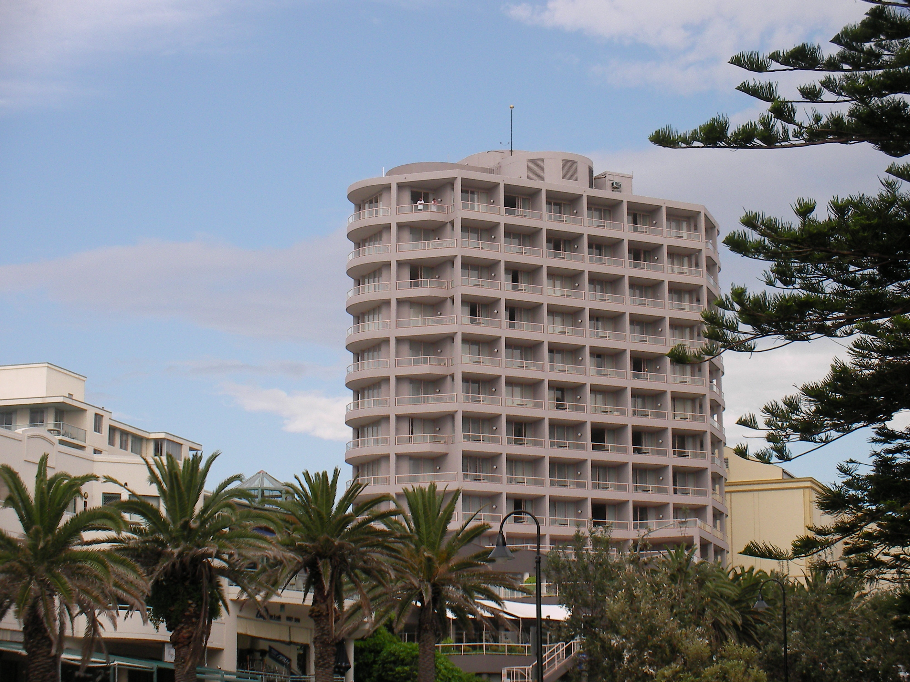

==================
NIAC2008 attendees
==================

.. container:: content

   .. container:: page

      .. rubric:: NIAC2008 attendees
         :name: NIAC2008_attendees_niac2008-attendees
         :class: page-title

      Attendees of the `2008 NIAC Meeting <NIAC2008.html>`__ at Rydges
      Cronulla Beach Hotel in Sydney, Australia.

      +----------------------+----------------------+----------------------+
      | Name                 | Company/Institute    |                      |
      +======================+======================+======================+
      | Peter Peterson       |                      | Oak Ridge National   |
      | (Chair) <Pet         |                      | Laboratory, USA      |
      | er_Peterson.html>    |                      |                      |
      +----------------------+----------------------+----------------------+
      | Freddie Akeroyd      |                      | ISIS, UK             |
      | (Secretary)          |                      |                      |
      | <Freddie_Akero       |                      |                      |
      | yd.html>             |                      |                      |
      +----------------------+----------------------+----------------------+
      | Nick                 |                      | Australian Nuclear   |
      | Hauser <             |                      | Science and          |
      | Nick_Hauser.html>    |                      | Technology           |
      |                      |                      | Organisation,        |
      |                      |                      | Australia            |
      +----------------------+----------------------+----------------------+
      | Jens-Uwe             |                      | Helmholtz Zentrum    |
      | Hof                  |                      | Berlin (HMI before), |
      | fmann <Jens-U        |                      | Germany              |
      | we_Hoffmann.html>    |                      |                      |
      +----------------------+----------------------+----------------------+
      | Mark                 |                      | Paul Scherrer        |
      | K                    |                      | Institut             |
      | oennecke <Mar        |                      |                      |
      | k_Koennecke.html>    |                      |                      |
      +----------------------+----------------------+----------------------+
      | Peter Lewis          |                      | Australian           |
      |                      |                      | Synchrotron          |
      +----------------------+----------------------+----------------------+
      | Jiro                 |                      | KEK, Japan           |
      | Suzuki <             |                      |                      |
      | Jiro_Suzuki.html>    |                      |                      |
      +----------------------+----------------------+----------------------+
      | Pete                 |                      | Argonne National     |
      | Jemian <             |                      | Laboratory, USA      |
      | Pete_Jemian.html>    |                      |                      |
      +----------------------+----------------------+----------------------+
      | Paul Lewis           | Los Alamos National  |                      |
      |                      | Laboratory           |                      |
      +----------------------+----------------------+----------------------+
      | Matthias             | Juelich              |                      |
      | Dro                  |                      |                      |
      | chner <Matthi        |                      |                      |
      | as_Drochner.html>    |                      |                      |
      +----------------------+----------------------+----------------------+

      |photo of NIAC 2008 attendees| |Rydges Cronulla Sydney hotel, site
      of NIAC2008 meeting| |Panorama view of North Cronulla Beach from
      Rydges Cronulla Sydney hotel, site of NIAC2008 meeting|

.. |photo of NIAC 2008 attendees| image:: ../extra_files/Niac2008-attendees.jpg
   :width: 400px

.. |Panorama view of North Cronulla Beach from Rydges Cronulla Sydney hotel, site of NIAC2008 meeting| image:: ../extra_files/Niac2008-view.jpg
   :width: 400px
